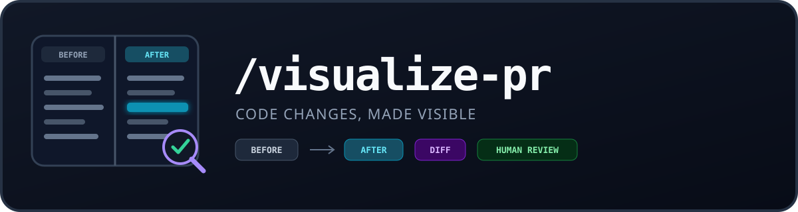
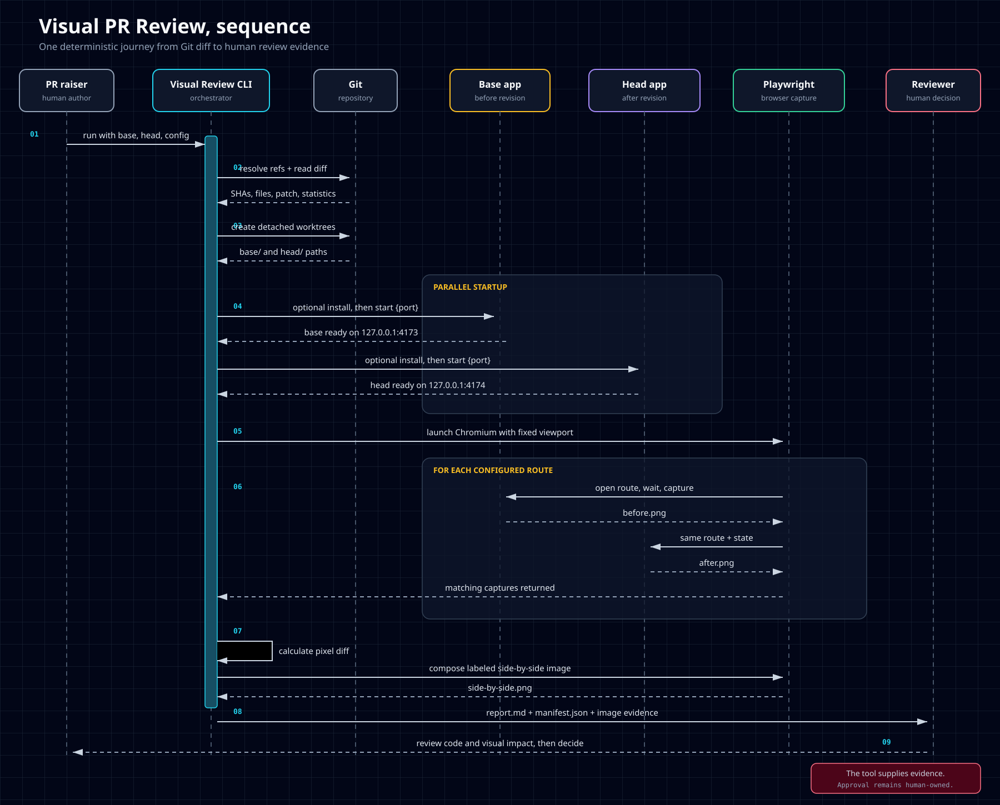

<p align="center">
  
</p>

<h1 align="center">Visual PR Review</h1>

<p align="center"><code>/visualize-pr</code> turns code changes into reviewer-ready visual evidence.</p>

A GitHub-friendly agent skill and CLI that turns web code changes into reviewer evidence.

The application under review may use any programming language. The current capture adapter supports browser-renderable applications that can start on a supplied local port. See [language and runtime support](docs/language-support.md) for the exact contract and examples.

## Sequence



The PR raiser runs it. The reviewer gets:

- before screenshot
- after screenshot
- labeled side-by-side image
- pixel-diff image
- Markdown report with code diff statistics
- full binary-safe Git patch
- JSON manifest with exact commit SHAs and capture settings

## Quick start

```bash
npm install
npx playwright install chromium
# Or reuse a compatible browser:
# export VISUAL_REVIEW_BROWSER_PATH=/path/to/chrome-headless-shell
```

In the web application repository, create `visual-review.json`:

```json
{
  "installCommand": "npm ci",
  "startCommand": "npm run dev -- --port {port}",
  "routes": [
    { "name": "Home", "path": "/" }
  ]
}
```

Then run:

```bash
node /path/to/visual-pr-review/scripts/visual-pr-review.mjs \
  --base origin/main \
  --head HEAD \
  --config visual-review.json \
  --output visual-review-output
```

Open `visual-review-output/report.md`.

## Why author-run first?

The author knows which routes and states changed. Capturing that intent before requesting review is cheaper and more accurate than asking a generic CI job to guess. The output is deliberately reviewer-facing, so the same format can later be generated in GitHub Actions.

## Safety boundary

The tool runs install and start commands from both Git revisions. Use trusted code or a sandbox. Screenshots are evidence of rendered output, not an approval verdict.

## Development

```bash
npm test
```

The deterministic demo uses two repository commits and is exercised during release verification.

## License

MIT
