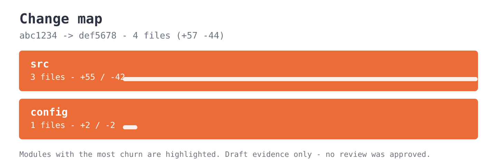
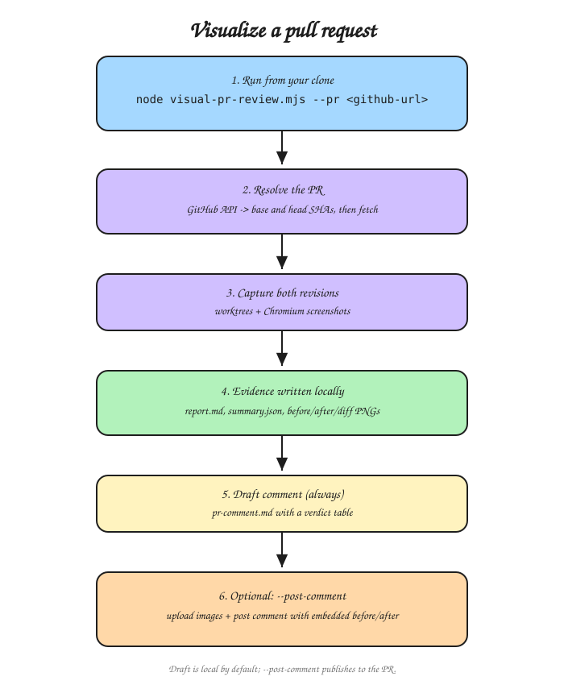

<p align="center">
  
</p>

<h1 align="center">Review what changed, not just which lines changed.</h1>

<p align="center">
  Turn a GitHub pull request or two local Git revisions into reviewer-ready evidence.<br>
  Browser screenshots for web changes. Diff summaries and change maps for backend changes.
</p>

<p align="center">
  <a href="skills/engineering/visual-pr-review/README.md"><strong>Explore the skill</strong></a> ·
  <a href="https://github.com/aryswisnu/skills/pull/1"><strong>Inspect the live PR</strong></a> ·
  <a href="https://github.com/aryswisnu/skills/pull/1#issuecomment-5657518950">See the generated comment</a> ·
  <a href="https://github.com/aryswisnu/skills/pull/2">Backend example</a> ·
  <a href="skills/engineering/visual-pr-review/docs/pr-comment-examples.md">Comment examples</a> ·
  <a href="skills/engineering/visual-pr-review/docs/usage-examples.md">Usage examples</a>
</p>

<p align="center">
  <a href="https://github.com/aryswisnu/skills/actions/workflows/test.yml"></a>
  <a href="LICENSE"></a>
  = 20">
  
</p>

---

## Table of contents

- [The problem](#the-problem)
- [What reviewers see](#what-reviewers-see)
- [Two review modes](#two-review-modes)
- [Install](#install)
- [How it works](#how-it-works)
- [What it deliberately does not do](#what-it-deliberately-does-not-do)
- [Project status](#project-status)
- [Repository layout](#repository-layout)
- [Verification](#verification)
- [License](#license)

---

## The problem

A code diff explains implementation. It rarely shows the state a reviewer actually cares about:

- Did the checkout screen visibly change?
- Did desktop and mobile change in the same way?
- Did the new revision introduce console, request, assertion, or document errors?
- Which backend modules absorbed most of the churn?
- What evidence should appear in the pull request without asking every reviewer to rebuild both
  revisions locally?

Visual PR Review checks out the exact base and head commits and generates local evidence. When a
GitHub PR URL is supplied, it also writes a review-comment draft. Publishing remains explicit. The
tool supplies evidence; the human supplies judgment.

## What reviewers see

Web changes produce real browser evidence, side by side:

[](skills/engineering/visual-pr-review/docs/pr-comment-examples.md)

Backend changes produce a diff summary plus an editorial change map:

[](skills/engineering/visual-pr-review/docs/pr-comment-examples.md)

The resulting comment includes:

- abbreviated base and head commit SHAs,
- scenario-by-viewport verdicts,
- an attention list for review-required or failed captures,
- embedded side-by-side evidence for published web reviews,
- a module and file-level change summary, plus an embedded change-map image, for backend reviews.

See the [complete web and backend comment examples](skills/engineering/visual-pr-review/docs/pr-comment-examples.md).
The current release can post a **comment** when `--post-comment` is supplied. It does not rewrite the
PR description.

## Two review modes

| Change surface | Evidence |
| --- | --- |
| **Web / UI** | Runs equivalent scenarios against both revisions, captures before, after, side-by-side, and optional pixel-diff PNGs, then compares semantic and runtime evidence. |
| **Backend / non-web** | Reads the Git diff without starting a browser, then writes a change summary and editorial `architecture.svg` change map; with `--post-comment`, rasterizes the map and embeds it in the comment. |

Successful runs also preserve the Git patch, statistics, machine-readable summary, and provenance
manifest. The browser workflow writes structured infrastructure-failure evidence after output
creation succeeds.

## Install

### Agent Skills-compatible hosts

```bash
npx skills@latest add aryswisnu/skills
```

Select `visual-pr-review` when prompted. The canonical skill lives at
[`skills/engineering/visual-pr-review/`](skills/engineering/visual-pr-review/).

### Clone and run the CLI

```bash
git clone https://github.com/aryswisnu/skills.git
cd skills/skills/engineering/visual-pr-review
npm install
npx playwright install chromium
```

Run the CLI from the application repository:

```bash
node /path/to/skills/skills/engineering/visual-pr-review/scripts/visual-pr-review.mjs \
  --pr https://github.com/owner/repo/pull/123 \
  --config visual-review.json \
  --output visual-review-output
```

For a backend or non-web PR, add `--backend`; no preview config or browser is required.

## How it works

1. Resolve the requested base and head to exact 40-character commit SHAs.
2. Collect the binary-safe patch and changed-file statistics.
3. Route to browser evidence or backend evidence.
4. Write a fresh local evidence directory. With `--pr`, also write `pr-comment.md`.
5. Upload evidence and post a PR comment only when `--post-comment` is explicitly supplied.
6. Keep human review authoritative. A verdict labels evidence; it never approves a change.



## What it deliberately does not do

- It does not approve or merge pull requests.
- It does not publish by default.
- It does not replace the pull request description.
- It does not pretend a backend diff summary is behavioral API testing.
- It does not claim complete network isolation. Main-frame navigation is pinned to the local preview
  origin, while application processes and subresources remain outside that boundary.
- It does not make untrusted PR code safe. Both revisions can execute repository-owned install,
  build, start, and application code, so use trusted commits or a sandbox.

## Project status

**Current release: v0.6.1**

Available now:

- local base/head comparison,
- GitHub pull request URL resolution,
- deterministic web scenario replay,
- desktop and mobile evidence,
- backend diff summaries and change maps,
- local PR comment drafts when `--pr` is used,
- opt-in evidence upload and GitHub comment publication.

Planned, not shipped: Bitbucket, GitLab, Azure DevOps, behavioral API replay, schema-aware diagrams,
CLI transcript comparison, native-mobile capture, and managed PR-description updates.

## Repository layout

```text
skills/
  engineering/
    visual-pr-review/
      SKILL.md               Agent Skill contract
      README.md              Full product and CLI documentation
      scripts/               Executable CLI
      src/                   Implementation
      test/                  Unit and integration tests
      docs/                  Examples, diagrams, verification, and boundaries
      examples/              Configurations and demo application
```

## Verification

The current implementation is covered by 141 tests, including real-browser checks when Chromium is
available, GitHub PR resolution against a mock API, backend CLI integration, cleanup, interruption,
redaction, provenance, and failure-boundary cases. See the
[verification record](skills/engineering/visual-pr-review/docs/verification.md) for commands and
observed results.

## License

MIT
