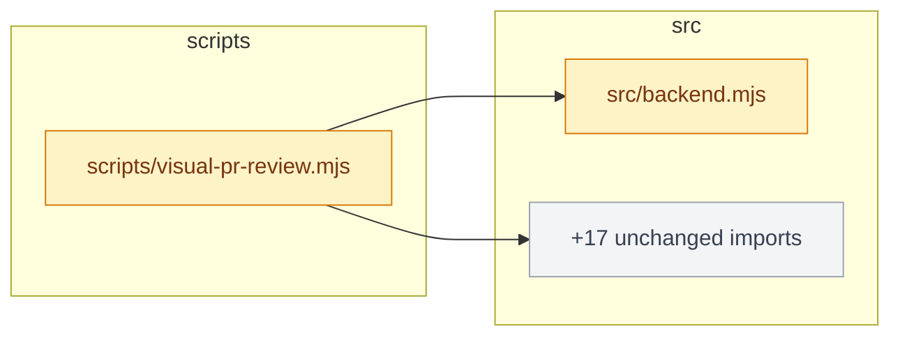
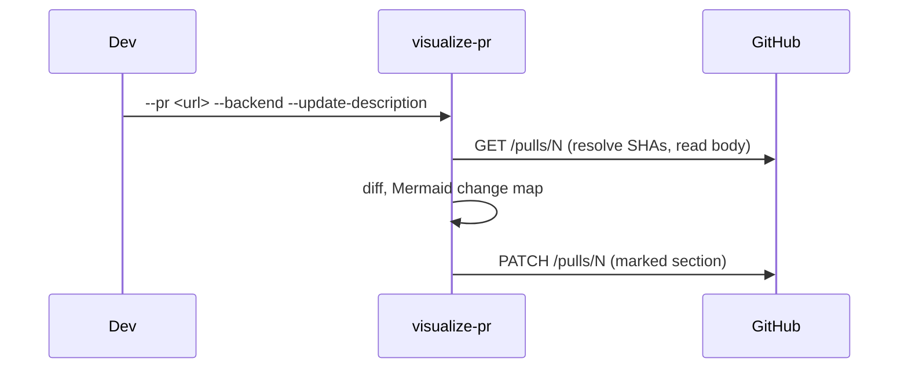

# Skills

[](https://github.com/aryswisnu/skills/actions/workflows/test.yml)
[](LICENSE)
[](#requirements)
[](#requirements)

Agent skills for real engineering work. Each one is small, composable, and built to hand a human
evidence rather than a verdict. Install once, type a slash command, get something a colleague can
act on.

Current release: **v0.9.0**. One skill shipped, more on the way.

---

## Table of contents

- [The skills](#the-skills)
- [Installation](#installation)
- [visualize-pr in 60 seconds](#visualize-pr-in-60-seconds)
- [What lands in the PR](#what-lands-in-the-pr)
- [How the agent runs it](#how-the-agent-runs-it)
- [Two review modes](#two-review-modes)
- [Live examples](#live-examples)
- [CLI reference](#cli-reference)
- [Safety boundary](#safety-boundary)
- [Requirements](#requirements)
- [Repository layout](#repository-layout)
- [Development](#development)
- [License](#license)

---

## The skills

Skills split on one axis: who can invoke them. **User-invoked** skills run only when you type
them. **Model-invoked** skills can also be picked up by the agent when a task fits.

### Engineering

**User-invoked**

| Skill | What it does | Docs |
| --- | --- | --- |
| [`/visualize-pr`](./skills/engineering/visualize-pr/SKILL.md) | Turns a GitHub PR or two Git revisions into reviewer-ready evidence and writes it into the PR itself: a Mermaid change map, an agent-authored sequence diagram, and (for web changes) before/after screenshots with runtime errors. | [page](./docs/engineering/visualize-pr.md) |

**Model-invoked**

None yet.

Full bucket list: [skills/engineering](./skills/engineering/README.md).

---

## Installation

Two routes. The **Claude Code plugin** installs a managed copy that updates when a release ships.
**skills.sh** copies editable files into your project. Pick one; both at once gives you every skill
twice.

<details open>
<summary><strong>Claude Code (plugin)</strong></summary>

```bash
claude plugins marketplace add aryswisnu/skills
```

```bash
claude plugins install aryswisnu-skills@aryswisnu
```

Or, from inside a session: `/plugin marketplace add aryswisnu/skills` then
`/plugin install aryswisnu-skills@aryswisnu`. Update later with
`claude plugins update aryswisnu-skills@aryswisnu`.

</details>

<details>
<summary><strong>Codex, and other agents (skills.sh)</strong></summary>

```bash
npx skills@latest add aryswisnu/skills
```

Pick the skills and the agents to install them on. Files land in your repo as ordinary files you
own.

</details>

### One extra step for web reviews

Plugin installers copy files but do not run npm. Backend reviews (diff summary, change map,
description update) work with nothing else installed. Web reviews need a browser, so once, inside
the installed skill folder:

```bash
npm install && npx playwright install chromium
```

The installed folder is `~/.claude/plugins/marketplaces/aryswisnu/skills/engineering/visualize-pr`
for the plugin route, or wherever skills.sh put it. If you skip this, the CLI tells you exactly
this command the first time it needs a browser.

---

## visualize-pr in 60 seconds

From a clone of the repository the PR belongs to:

```bash
node <skill>/scripts/visualize-pr.mjs --pr https://github.com/<owner>/<repo>/pull/<n> --backend --update-description --output visual-review-output
```

That resolves the PR's exact base and head commits, analyzes the diff, and inserts a review block
into the PR description with a Mermaid change map that GitHub renders natively. Re-run it and the
block is replaced in place. Nothing is uploaded. `GITHUB_TOKEN` or `GH_TOKEN` with write access is
required only for the description update; drop the flag and you get a local `pr-comment.md` draft.

For a web change, generate a config first, then run without `--backend`:

```bash
node <skill>/scripts/visualize-pr.mjs --init
```

`--init` detects the framework (Next, Vite, Astro, Nuxt, Angular, SvelteKit, Remix, Django, Rails,
Laravel, Go, static HTML, and more), picks the install command from your lockfile, and seeds a home
scenario on desktop and mobile. Edit the start command if needed, add scenarios for the pages the
PR touches, and run.

---

## What lands in the PR

A backend review puts this in the description (this exact block came from
[PR #2](https://github.com/aryswisnu/skills/pull/2), trimmed):



Above it: abbreviated SHAs, files changed, a per-module table, the most changed files. Green means
added, amber modified, red deleted, grey untouched. When a file imports more than five unchanged
modules they fold into one node so the diagram stays readable.

With `--diagram`, the agent adds a sequence diagram of the changed behavior:



A web review adds real browser evidence, uploaded to a `visual-review-assets` branch and embedded:

[](skills/engineering/visualize-pr/docs/pr-comment-examples.md)

Every web cell gets a verdict: `unchanged`, `changed-within-threshold`, `review-required`, or
`capture-failed`. None of them approves anything. Full rendered examples:
[pr-comment-examples.md](skills/engineering/visualize-pr/docs/pr-comment-examples.md).

---

## How the agent runs it

Type `/visualize-pr <pr-url>` in Claude Code. The skill is user-invoked: the agent never fires it on
its own, because it runs the install and start commands of both revisions. The workflow it follows:

1. Resolve base and head to exact SHAs, read the diff, decide backend or web.
2. If web and no `visual-review.json`, run `--init`, fix the start command against the repo's own
   scripts, add scenarios for the paths the diff touches.
3. Run the CLI. Read `changes.patch`. Write a Mermaid `sequenceDiagram` of the changed call flow
   (skipped, and said so, when the diff has no behavior change).
4. Re-run with `--diagram` and a fresh output directory. Inspect `report.md` and the images.
5. Only after a human has read the draft: `--update-description` or `--post-comment`.

The contract the agent must satisfy before calling it done, including exit codes, evidence
accounting, and cleanup checks, is in [SKILL.md](./skills/engineering/visualize-pr/SKILL.md).

---

## Two review modes

| | Backend (`--backend`) | Web (default) |
| --- | --- | --- |
| Needs | Git, Node 20+ | plus `visual-review.json`, Chromium |
| Boots the app | No | Yes, both revisions on separate local ports |
| Produces | change summary, Mermaid change map, `architecture.svg` | before/after/side-by-side/diff PNGs per scenario and viewport, console and request errors, ARIA snapshot |
| Uploads | Nothing | Screenshots to `visual-review-assets` branch (only with `--post-comment` or `--update-description`) |
| Config | None | `--init` writes a starter |

Both modes write `report.md`, `summary.json`, `manifest.json`, `changes.patch`, and
`changes-stat.txt`. Web manifests carry SHA-256 hashes of every artifact, the browser build, and
redacted commands, so a reviewer can check the directory matches the commits.

---

## Live examples

- [PR #1](https://github.com/aryswisnu/skills/pull/1): web review, [posted comment](https://github.com/aryswisnu/skills/pull/1#issuecomment-5657518950) with three embedded side-by-side images.
- [PR #2](https://github.com/aryswisnu/skills/pull/2): backend review. The description carries the Mermaid change map written by `--update-description`; the [earlier comment](https://github.com/aryswisnu/skills/pull/2#issuecomment-5657923277) shows the v0.6 PNG form for comparison.

Both are kept open on purpose.

---

## CLI reference

```text
--pr <url>            GitHub pull request URL; resolves base and head SHAs
--base <ref>          Base git revision, required unless --pr is used
--head <ref>          Head git revision, default: HEAD
--backend             Diff summary + Mermaid change map, no browser or config
--init                Write a starter visual-review.json for this repo, then exit
--diagram <path>      Mermaid file (for example a sequenceDiagram) to include in the report and PR text
--update-description  Insert or refresh the review block in the PR description (requires --pr)
--post-comment        Post the review as a PR comment (requires --pr)
--config <path>       Config path, default: visual-review.json
--output <path>       Artifact directory, default: visual-review-output (must not exist)
--scenario <id>       Capture only this scenario, repeatable, overrides impact rules
--all                 Capture every configured scenario, ignoring impact rules
--keep-worktrees      Preserve temporary worktrees for debugging
```

Exit codes: `0` comparable evidence for every selected cell, `1` at least one scenario failed to
capture (partial report), `2` usage, configuration, or infrastructure failure (`failure.json`
written when possible), `130` SIGINT, `143` SIGTERM.

Configuration keys, scenario steps, impact rules, and every worked example:
[configuration.md](skills/engineering/visualize-pr/docs/configuration.md),
[usage-examples.md](skills/engineering/visualize-pr/docs/usage-examples.md).

---

## Safety boundary

- Web mode runs the install and start commands of **both** revisions. That is arbitrary code
  execution by design. Use trusted revisions or a sandbox.
- Browser navigation is pinned to the local preview origin for main-frame documents. Application
  processes and outbound requests are not isolated.
- Environment values and command credentials are redacted from structured artifacts. Screenshots
  are masked only at configured selectors; look at the images before sharing.
- Nothing leaves your machine without `--post-comment` or `--update-description`. The description
  update touches only the block between `<!-- visualize-pr:start -->` and
  `<!-- visualize-pr:end -->`.

---

## Requirements

Node.js 20 or newer, Git, Linux or macOS. Windows is not claimed: process-group cleanup and shell
semantics are only tested on POSIX. Web reviews need Playwright Chromium or a compatible executable
via `VISUAL_REVIEW_BROWSER_PATH`.

---

## Repository layout

```text
.claude-plugin/       Plugin and marketplace manifests
docs/<bucket>/        One human-facing page per promoted skill
skills/<bucket>/      One folder per skill, each with SKILL.md and agents/openai.yaml
  engineering/visualize-pr/
    scripts/          The CLI
    src/              Implementation (mermaid.mjs, init.mjs, backend.mjs, capture.mjs, ...)
    test/             202 tests, node --test
    docs/             CLI reference, examples, verification record
    examples/         Starter configs, demo app, GitHub Actions workflow
scripts/              Maintainer helpers (list-skills, link-skills)
CHANGELOG.md          Release history
CLAUDE.md             Rules for agents working on this repo (AGENTS.md is a symlink)
```

---

## Development

```bash
scripts/list-skills.sh
scripts/link-skills.sh            # symlink promoted skills into ~/.claude/skills and ~/.agents/skills
claude plugin validate .
cd skills/engineering/visualize-pr && npm install && npx playwright install chromium && npm test
```

CI runs the suite on Ubuntu and macOS for every push and PR. See [CHANGELOG.md](./CHANGELOG.md)
for what changed in each release.

---

## License

MIT
