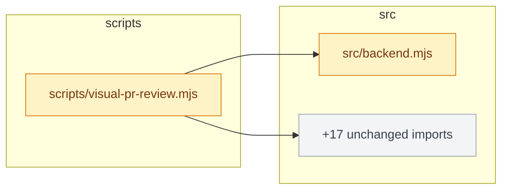
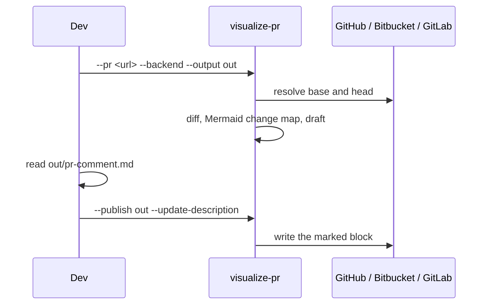

# Skills

[](https://github.com/aryswisnu/skills/actions/workflows/test.yml)
[](LICENSE)
[](#requirements)
[](#requirements)

Agent skills for real engineering work. Each one is small, composable, and built to hand a human
evidence rather than a verdict. Install once, type a slash command, review what it drafted,
approve with one click.

Current release: **v0.14.0**. One skill shipped, more on the way.

---

## Table of contents

- [The skills](#the-skills)
- [Installation](#installation)
- [visualize-pr in 60 seconds](#visualize-pr-in-60-seconds)
- [Review, then approve](#review-then-approve)
- [What lands in the PR](#what-lands-in-the-pr)
- [ASCII fallback](#ascii-fallback)
- [Providers](#providers)
- [Two review modes](#two-review-modes)
- [How the agent runs it](#how-the-agent-runs-it)
- [Live examples](#live-examples)
- [CLI reference](#cli-reference)
- [Safety boundary](#safety-boundary)
- [Requirements](#requirements)
- [Repository layout](#repository-layout)
- [Development](#development)
- [License](#license)

---

## The skills

Skills split on one axis: who can invoke them. **User-invoked** skills run only when you type
them. **Model-invoked** skills can also be picked up by the agent when a task fits.

### Engineering

**User-invoked**

| Skill | What it does | Docs |
| --- | --- | --- |
| [`/visualize-pr`](./skills/engineering/visualize-pr/SKILL.md) | Turns a pull request on GitHub, Bitbucket Cloud, or GitLab, or any two Git revisions, into reviewer-ready evidence and writes it into the PR: a Mermaid change map, an agent-authored sequence diagram, and for web changes before/after screenshots with runtime errors. You review the draft first and approve with one click. | [page](./docs/engineering/visualize-pr.md) |

**Model-invoked**

None yet.

Full bucket list: [skills/engineering](./skills/engineering/README.md).

---

## Installation

Two routes. The **Claude Code plugin** installs a managed copy that updates when a release ships.
**skills.sh** copies editable files into your project. Pick one; both at once gives you every skill
twice.

<details open>
<summary><strong>Claude Code (plugin)</strong></summary>

```bash
claude plugins marketplace add aryswisnu/skills
```

```bash
claude plugins install aryswisnu-skills@aryswisnu
```

Or, from inside a session: `/plugin marketplace add aryswisnu/skills` then
`/plugin install aryswisnu-skills@aryswisnu`. Update later with
`claude plugins update aryswisnu-skills@aryswisnu`. Restart the session after installing.

</details>

<details>
<summary><strong>Codex, and other agents (skills.sh)</strong></summary>

```bash
npx skills@latest add aryswisnu/skills
```

Pick the skills and the agents to install them on. Files land in your repo as ordinary files you
own.

</details>

### Then let it install itself

Plugin installers copy files but do not run npm, so the skill installs its own dependencies on
request:

```bash
node <skill>/scripts/visualize-pr.mjs --setup
```

That pulls the npm dependencies and Chromium into the skill's own folder. Add `--backend` to
install the dependencies only and skip the 100MB browser download; backend reviews need nothing
else. You do not have to remember this: the agent checks for dependencies and runs `--setup`
before the first review, and any `Missing dependency` error names the same flag. Running on Node
18 exits at once with the minimum version and how to switch, instead of a stack trace.

The installed folder is `~/.claude/plugins/marketplaces/aryswisnu/skills/engineering/visualize-pr`
for the plugin route, or wherever skills.sh put it.

---

## visualize-pr in 60 seconds

From a clone of the repository the PR belongs to. Step one drafts and posts nothing:

```bash
node <skill>/scripts/visualize-pr.mjs --pr https://github.com/<owner>/<repo>/pull/<n> --backend --output out
```

That resolves the PR's exact base and head commits, analyzes the diff, and writes `out/report.md`
and `out/pr-comment.md` with a Mermaid change map. Read the draft. Step two publishes it as
written, in under a second:

```bash
node <skill>/scripts/visualize-pr.mjs --publish out --update-description
```

The review block lands in the PR description between marker comments; re-run and it is replaced in
place. Swap `--update-description` for `--post-comment`, or pass both. A Bitbucket Cloud or GitLab
URL works the same way; see [Providers](#providers) for the token each one reads.

For a web change, generate a config first, then run without `--backend`:

```bash
node <skill>/scripts/visualize-pr.mjs --init
```

`--init` detects the framework (Next, Vite, Astro, Nuxt, Angular, SvelteKit, Remix, Django, Rails,
Laravel, Go, static HTML, and more), picks the install command from your lockfile, and seeds a home
scenario on desktop and mobile. Edit the start command if needed, add scenarios for the pages the
PR touches, and run.

---

## Review, then approve

Nothing leaves your machine until you say so, and saying so is one click in every harness.

1. The review run writes the draft and stops. It prints the publish command.
2. The agent shows you the draft inline and asks: **post as a comment**, **update the
   description**, **both**, or **not now**.
   - In Claude Code those four choices render as buttons.
   - In Codex and other harnesses the agent proposes the single publish command, and the
     harness's own command-approval prompt is the button.
3. Approval runs `--publish <dir>` with the flag you picked. No re-diff, no fetch, no browser.
   What you read is what lands. A GitHub web review uploads its screenshots at that moment and
   appends them below the text you already read.

"Not now" ends with the draft path and the publish command written out, so you can run it later
yourself. Passing `--post-comment` or `--update-description` on the review run itself still works
and skips the checkpoint; the agent only does that when you asked for it up front.

---

## What lands in the PR

The PR text leads with the agent's notes from `--notes`: a few bullets on what changed and why,
and a short pseudocode block for the core rule. Under that, one line with the file count and the
files, then the diagrams. A one-file change gets no module table and no ranking, because they
would only repeat that line. The block is delimited by CommonMark link reference definitions,
which render as nothing on every forge, so re-runs replace it in place with no visible markers.

A backend review puts this in the description (this exact block came from
[PR #2](https://github.com/aryswisnu/skills/pull/2), trimmed):



Where Mermaid is not rendered, the same map arrives as text; see [ASCII fallback](#ascii-fallback).

Above it: abbreviated SHAs, files changed, a per-module table, the most changed files. Green means
added, amber modified, red deleted, grey untouched. When a file imports more than five unchanged
modules they fold into one node so the diagram stays readable. The import graph covers JavaScript
and TypeScript, Python, Go, Ruby, PHP, Java and Kotlin, Rust, and C#.

With `--diagram`, the agent adds a sequence diagram of the changed behavior:



The `--diagram` file is linted for the two Mermaid mistakes that render wrong instead of failing:
a `%%` comment that is not at the start of a line, and angle brackets inside a label. Both are
warnings with line numbers; the run continues.

A web review adds real browser evidence, uploaded to a `visual-review-assets` branch and embedded:

[](skills/engineering/visualize-pr/docs/pr-comment-examples.md)

Every web cell gets a verdict: `unchanged`, `changed-within-threshold`, `review-required`, or
`capture-failed`. None of them approves anything. Full rendered examples:
[pr-comment-examples.md](skills/engineering/visualize-pr/docs/pr-comment-examples.md).

---

## ASCII fallback

Mermaid is only useful where it is rendered. GitHub and GitLab render it; Bitbucket Cloud renders
CommonMark only, so a Mermaid fence there shows as raw source. The CLI therefore picks the diagram
form per provider, and `--ascii` forces text anywhere, including the local `report.md`, for a
terminal, an email, or any renderer without Mermaid. Both `change-map.mmd` and `change-map.txt`
are written on every backend run regardless.

The change map as text, real output from this repository over six commits, trimmed:

```text
Change map  713e339 -> e31d673  (19 changed files)

  scripts/
    [M] visualize-pr.mjs             -> ascii.mjs, providers.mjs, report.mjs, +21 unchanged imports
  src/
    [A] ascii.mjs
    [M] backend.mjs
    [A] provider-bitbucket.mjs
    [ ] provider-github.mjs          (imported by 1)
    [A] provider-gitlab.mjs
    [A] providers.mjs                -> provider-bitbucket.mjs, provider-github.mjs, provider-gitlab.mjs
    [M] report.mjs                   -> backend.mjs
  test/
    [A] ascii.test.mjs               -> ascii.mjs
    [A] providers.test.mjs           -> pr-url.mjs, providers.mjs

  [A] added  [M] modified  [D] deleted  [R] renamed  [ ] unchanged
```

Files group by directory. Each line carries a status marker, the file, and the in-repo files it
imports; an unchanged file that a changed file imports shows how many import it instead. More than
five unchanged imports from one file fold into a single `+N unchanged imports` target, listed
last.

The `--diagram` sequence diagram gets the same treatment. A Mermaid `sequenceDiagram` is redrawn
as text: participants and aliases, solid and dashed arrows, self-messages, notes, and
loop/alt/opt/par blocks. Real output:

```text
       Dev        visualize-pr      Bitbucket
        |               |               |
        |  --pr <url> --backend         |
        |--------------->               |
        |               |  GET pullrequests/N
        |               |--------------->
        |               |  200          |
        |               <- - - - - - - -|
        |               [ draft written ]
        |  --publish out|               |
        |--------------->               |
        |               |  PUT description
        |               |--------------->
```

Any Mermaid the renderer cannot parse is shown as fenced source rather than dropped, so nothing
the agent wrote is lost. Which form was used is recorded in `pr.json`, so `--publish` keeps it.

---

## Providers

The provider is read from the URL's path shape, not its host, so self-hosted instances work with
no configuration.

| Provider | URL shape | Token | Diagrams | Screenshots |
| --- | --- | --- | --- | --- |
| GitHub | `/owner/repo/pull/N` | `GITHUB_TOKEN` or `GH_TOKEN` | Mermaid | uploaded and embedded |
| Bitbucket Cloud | `/workspace/repo/pull-requests/N` | `BITBUCKET_TOKEN`, or `BITBUCKET_USERNAME` with `BITBUCKET_APP_PASSWORD` | ASCII (Bitbucket does not render Mermaid) | stay local; verdicts and diagrams post |
| GitLab | `/group/.../repo/-/merge_requests/N` | `GITLAB_TOKEN` (or `CI_JOB_TOKEN`) | Mermaid | stay local; verdicts and diagrams post |

Backend reviews upload nothing anywhere. The change map is Mermaid on GitHub and GitLab, which
render it, and ASCII on Bitbucket Cloud, which renders CommonMark only; `--ascii` forces the text
form anywhere, including the local `report.md`. Nested GitLab groups are handled. Bitbucket returns abbreviated
commit hashes, so the CLI fetches the PR's branches with the clone's own credentials and resolves
the hashes locally. Bitbucket Server (Data Center) is detected and refused with a message; Azure
DevOps is not implemented.

---

## Two review modes

| | Backend (`--backend`) | Web (default) |
| --- | --- | --- |
| Needs | Git, Node 20+ | plus `visual-review.json`, Chromium |
| Boots the app | No | Yes, both revisions on separate local ports |
| Produces | change summary, Mermaid change map, `architecture.svg` | before/after/side-by-side/diff PNGs per scenario and viewport, console and request errors, ARIA snapshot |
| Diagrams | Mermaid, or ASCII where the forge does not render Mermaid or with `--ascii` | sequence diagram from `--diagram`, same rule |
| Uploads | Nothing, on any provider | GitHub only: side-by-side PNGs to `visual-review-assets`, at publish time |
| Config | None | `--init` writes a starter |

Both modes write `report.md`, `summary.json`, `manifest.json`, `changes.patch`,
`changes-stat.txt`, and with `--pr` the `pr-comment.md` draft plus `pr.json` that `--publish`
reads. Web manifests carry SHA-256 hashes of every artifact, the browser build, and redacted
commands, so a reviewer can check the directory matches the commits.

---

## How the agent runs it

Type `/visualize-pr <pr-url>` in Claude Code. The skill is user-invoked: the agent never fires it on
its own, because it runs the install and start commands of both revisions. The workflow it follows:

1. Check for dependencies; run `--setup` if `node_modules` is missing.
2. Resolve base and head to exact SHAs, read the diff, decide backend or web.
3. If web and no `visual-review.json`, run `--init`, fix the start command against the repo's own
   scripts, add scenarios for the paths the diff touches.
4. Run the CLI with no publish flag. Read `changes.patch`. Write the notes (bullets and pseudocode)
   and a Mermaid `sequenceDiagram` of the changed call flow, the diagram skipped and said so when
   the diff has no behavior change.
5. Re-run with `--notes` and `--diagram` and a fresh output directory. Inspect `report.md` and the
   images.
6. Show the draft and ask, as in [Review, then approve](#review-then-approve). On approval run
   `--publish`. This is the only point at which publication is authorized.

The full contract, including exit codes, evidence accounting, and cleanup checks, is in
[SKILL.md](./skills/engineering/visualize-pr/SKILL.md).

---

## Live examples

- [PR #1](https://github.com/aryswisnu/skills/pull/1): web review, [posted comment](https://github.com/aryswisnu/skills/pull/1#issuecomment-5657518950) with three embedded side-by-side images.
- [PR #2](https://github.com/aryswisnu/skills/pull/2): backend review. The description carries the Mermaid change map written by `--update-description`; the [earlier comment](https://github.com/aryswisnu/skills/pull/2#issuecomment-5657923277) shows the v0.6 PNG form for comparison.

Both are kept open on purpose.

---

## CLI reference

```text
Review
  --pr <url>            GitHub, Bitbucket Cloud, or GitLab pull/merge request URL
  --base <ref>          Base git revision, required unless --pr is used
  --head <ref>          Head git revision, default: HEAD
  --backend             Diff summary + Mermaid change map, no browser or config
  --notes <path>        Agent-written markdown (bullets, pseudocode) placed at the top of the PR text
  --diagram <path>      Mermaid file (for example a sequenceDiagram) to include; linted, warnings only
  --ascii               Draw the change map and sequence diagram as ASCII (automatic on Bitbucket Cloud)
  --config <path>       Config path, default: visual-review.json
  --output <path>       Artifact directory, default: visual-review-output (must not exist)
  --scenario <id>       Capture only this scenario, repeatable, overrides impact rules
  --all                 Capture every configured scenario, ignoring impact rules
  --keep-worktrees      Preserve temporary worktrees for debugging

Publish
  --publish <dir>       Post the reviewed draft in <dir>/pr-comment.md; nothing is recomputed
  --post-comment        Post the review as a PR comment (with --pr or --publish)
  --update-description  Insert or refresh the review block in the PR description (with --pr or --publish)

Setup
  --setup               Install this skill's npm dependencies and Chromium, then exit (--backend skips Chromium)
  --init                Write a starter visual-review.json for this repo, then exit
```

Exit codes: `0` comparable evidence for every selected cell, `1` at least one scenario failed to
capture (partial report), `2` usage, configuration, or infrastructure failure (`failure.json`
written when possible), `130` SIGINT, `143` SIGTERM.

Configuration keys, scenario steps, impact rules, and every worked example:
[configuration.md](skills/engineering/visualize-pr/docs/configuration.md),
[usage-examples.md](skills/engineering/visualize-pr/docs/usage-examples.md).

---

## Safety boundary

- Web mode runs the install and start commands of **both** revisions. That is arbitrary code
  execution by design. Use trusted revisions or a sandbox.
- Browser navigation is pinned to the local preview origin for main-frame documents. Application
  processes and outbound requests are not isolated.
- Environment values and command credentials are redacted from structured artifacts. Screenshots
  are masked only at configured selectors; look at the images before sharing.
- Nothing leaves your machine without `--post-comment` or `--update-description`, and the normal
  path puts those behind `--publish`, after you have read the draft. The description update
  touches only the block between `<!-- visualize-pr:start -->` and `<!-- visualize-pr:end -->`.
- Non-GitHub providers get no injected git credential; the clone's own credentials fetch the
  branches.

---

## Requirements

Node.js 20 or newer (checked at startup), Git, Linux or macOS. Windows is not claimed:
process-group cleanup and shell semantics are only tested on POSIX. Web reviews need Playwright
Chromium, which `--setup` installs, or a compatible executable via `VISUAL_REVIEW_BROWSER_PATH`.

---

## Repository layout

```text
.claude-plugin/       Plugin and marketplace manifests
docs/<bucket>/        One human-facing page per promoted skill
skills/<bucket>/      One folder per skill, each with SKILL.md and agents/openai.yaml
  engineering/visualize-pr/
    scripts/          The CLI
    src/              mermaid, diagram-lint, init, setup, providers (github, bitbucket, gitlab),
                      pr-description, backend, capture, report, ...
    test/             267 tests, node --test; end-to-end runs use real Chromium and mock forge APIs
    docs/             CLI reference, examples, verification record
    examples/         Starter configs, demo app, GitHub Actions workflow
scripts/              Maintainer helpers (list-skills, link-skills)
CHANGELOG.md          Release history
CLAUDE.md             Rules for agents working on this repo (AGENTS.md is a symlink)
```

---

## Development

```bash
scripts/list-skills.sh
scripts/link-skills.sh            # symlink promoted skills into ~/.claude/skills and ~/.agents/skills
claude plugin validate .
cd skills/engineering/visualize-pr && node scripts/visualize-pr.mjs --setup && npm test
```

CI runs the suite on Ubuntu and macOS for every push and PR. See [CHANGELOG.md](./CHANGELOG.md)
for what changed in each release.

---

## License

MIT
