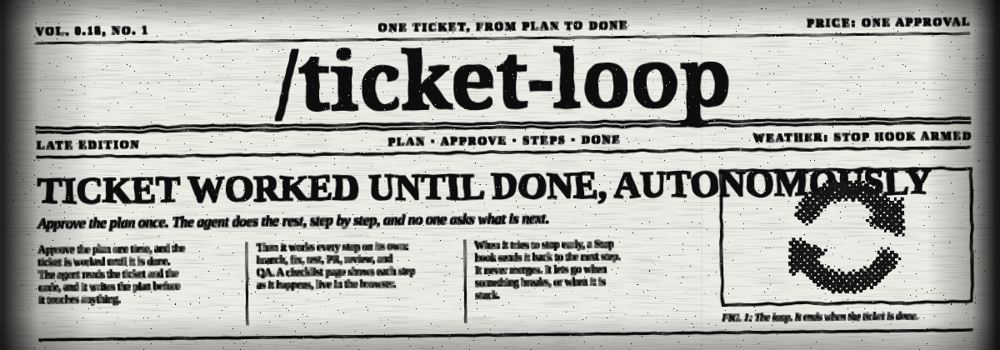
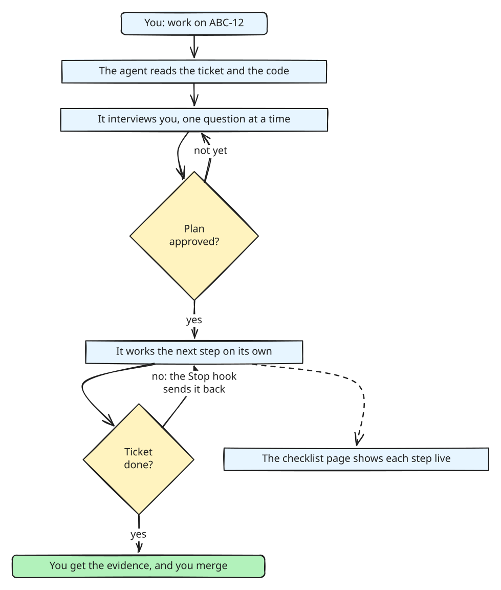
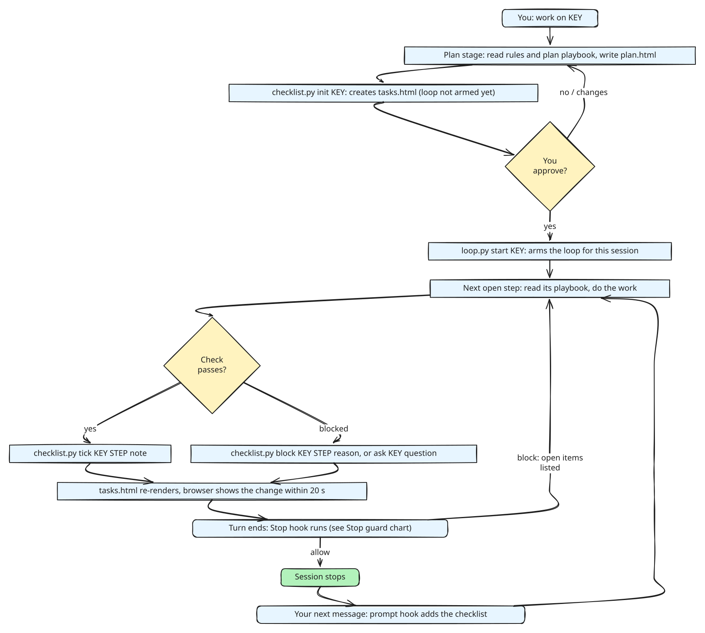
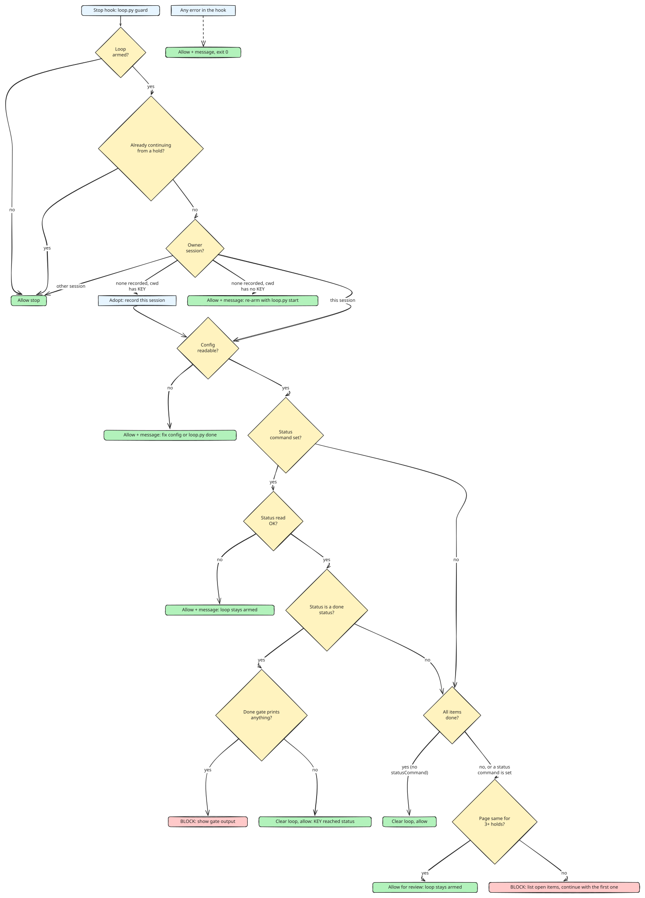

<p align="center">
  
</p>

<h1 align="center">Ticket Loop</h1>

<p align="center"><code>ticket-loop</code> takes one ticket from plan to done, keeps its state in a live checklist page, and will not let the agent stop halfway.</p>

<p align="center"><sub>Say "work on ABC-12" in Claude Code with the plugin installed. The agent picks the skill up on its own.</sub></p>

## The problem it solves

You give an agent a ticket. It does part of the work, and then it stops and waits for you:

- after it raises the PR, but before review, QA, or the ticket status;
- after it starts a watcher, with "I will tell you when CI is done";
- after a summary that says what it will do next, instead of doing it.

Each stop costs you a message and a context switch. On a long ticket that happens many times, and you
become the loop.

`ticket-loop` makes the agent carry the ticket to done by itself. It has three parts:

| Part | What it does for you |
| --- | --- |
| **A checklist page per ticket** | One `tasks.html` shows every step, what is done, what runs now, and what is blocked. It updates in your browser while the agent works. |
| **A Stop hook** | When the agent tries to stop with open steps, the hook sends it back to the first open step. It lets go when something is broken or stuck, so it cannot trap you. |
| **One approval gate** | You approve the plan one time. After that, the agent works to the done status and sends you the evidence. It never merges. |

Nothing about your team is in this skill. Your tracker URL, your statuses, your steps, and your team's
own rules live in a private config file on your machine.

| Without `ticket-loop` | With `ticket-loop` |
| --- | --- |
| "PR raised. Want me to request a review?" | The agent requests the review, answers comments, and ticks the step. |
| You ask "where are we?" | You look at the page, or read the list at the end of any answer. |
| A stuck agent waits without a word. | The step turns red on the page, with the reason. |
| Progress lives in the chat, and it is lost on a new session. | Progress lives in `tasks.html`, and a new session continues from it. |

## How it works



You talk to the agent twice: in the plan interview, and when you get the evidence. Between the two, the
agent works on its own, and the Stop hook sends it back whenever it tries to stop early. The detailed
charts are in [How the loop runs](#how-the-loop-runs) and [The Stop guard](#the-stop-guard).

## Words used in this README

| Word | Meaning |
| --- | --- |
| **Ticket key** | The ID of the ticket, for example `ABC-12`. It must match `keyPattern` in the config. |
| **Step** | One row on the checklist, for example "PR raised". Each step has a check that proves it is done. |
| **Tick** | Mark a step done with `checklist.py tick`. The agent ticks only after the check passes. |
| **Armed** | The loop is on for one ticket and one session. `loop.py start` arms it, `loop.py done` disarms it. |
| **Hold** | The Stop hook refuses one stop and tells the agent what to do next. |
| **Done status** | A tracker status, such as `Done`, that ends the loop. You list them in `doneStatuses`. |
| **Playbook** | A private Markdown file with your team's rules for one step. |

## Table of contents

- [How it works](#how-it-works)
- [In 60 seconds](#in-60-seconds)
- [Your first ticket](#your-first-ticket)
- [How the loop runs](#how-the-loop-runs)
- [Install](#install)
- [Configuration](#configuration)
- [Steps, stages, and playbooks](#steps-stages-and-playbooks)
- [The checklist page](#the-checklist-page)
- [The Stop guard](#the-stop-guard)
- [Plan and explainer pages](#plan-and-explainer-pages)
- [Keep your data private](#keep-your-data-private)
- [Config examples](#config-examples)
- [Troubleshooting](#troubleshooting)
- [FAQ](#faq)
- [Known limits](#known-limits)
- [Development](#development)

## In 60 seconds

```bash
claude plugins marketplace add aryswisnu/skills
claude plugins install aryswisnu-skills@aryswisnu
mkdir -p ~/.config/ticket-loop
cp "$(find ~/.claude/plugins/cache -path '*ticket-loop/config.example.json' | head -1)" ~/.config/ticket-loop/config.json
```

Edit `~/.config/ticket-loop/config.json`: set `keyPattern` and `issueUrl` for your tracker, and
`artifacts.dir` for where the pages go. Restart Claude Code, then say:

> work on ABC-12

The agent reads the ticket, writes `~/ticket-loop/ABC-12/plan.html` and `tasks.html`, and waits for
your approval. Open `tasks.html` in a browser and leave it open. It follows the loop without a reload.

## Your first ticket

What you do, and what you see:

1. **Say "work on ABC-12".** The agent reads the ticket and the code.
2. **Answer the interview.** The agent asks you about the plan, one question at a time, each with its
   recommended answer. It follows each answer into the next open decision, and stops when none is open.
   Then it writes `plan.html` with the root cause, the files, the tests, and the risks, and it creates
   `tasks.html`. The Stop hook is not on yet, so the agent can stop and wait for you.
3. **Read the plan, and answer.** Say "approved", or ask for changes. The agent changes nothing in the
   code before you approve.
4. **Watch the page, or do other work.** The agent arms the loop and works the steps in order. The
   current step pulses on the page. Each done step gets a check mark and a note with its proof, such as
   a commit hash or a PR link.
5. **Answer a question if one appears.** When the agent needs a product decision, a question card shows
   on the page and the agent stops. Answer in the agent session. The loop continues.
6. **Get the evidence.** When the ticket reaches a done status, the Stop hook clears the loop. The agent
   sends you the links: PR, preview, screenshots, and explainer. You merge.

To stop the loop at any time, run `loop.py done`, or ask the agent to run it. The checklist page
stays, so `loop.py start ABC-12` later continues from the same steps.

## How the loop runs



The same flow as a timeline:

```text
  you                     agent                                   hooks
   |   "work on ABC-12"     |                                        |
   |----------------------->|  plan: read ticket + code              |
   |                        |  write plan.html, checklist.py init    |
   |   plan link            |                                        |
   |<-----------------------|                                        |
   |   "approved"           |                                        |
   |----------------------->|  start: claim ticket, loop.py start ---> sentinel armed
   |                        |  worktree, run, fix/audit, commit      |
   |                        |  pr, review, verify, artifacts         |
   |                        |  (tick each step after its check)      |
   |                        |  tries to stop with open steps  -----> Stop hook: "continue with step 5"
   |                        |  ...                                   |
   |                        |  status reaches a done status   -----> Stop hook: loop cleared
   |   evidence + links     |                                        |
   |<-----------------------|                                        |
```

The agent may end a turn only in four cases: the plan waits for your approval, it needs a product
decision from you (it puts a question card on the page), teardown refuses because work is not pushed,
or the checklist is complete.

## Install

**Claude Code plugin (recommended).** The plugin installs the skill and both hooks:

```bash
claude plugins marketplace add aryswisnu/skills
claude plugins install aryswisnu-skills@aryswisnu
```

The hooks need `python3` on the `PATH`. Without it they exit quietly and do nothing, so a plugin user
who only wants `visualize-pr` sees no change.

**skills.sh, a symlink, or a copy.** You get the skill but not the hooks. Add them to
`~/.claude/settings.json` yourself, and point them at the skill folder:

```json
{
  "hooks": {
    "Stop": [{ "hooks": [{ "type": "command", "timeout": 30,
      "command": "python3 /path/to/ticket-loop/scripts/loop.py guard" }] }],
    "UserPromptSubmit": [{ "hooks": [{ "type": "command", "timeout": 30,
      "command": "python3 /path/to/ticket-loop/scripts/loop.py prompt" }] }]
  }
}
```

Use one route only. With both, each hook runs twice.

**Requirements.** Python 3.8 or newer, standard library only. Git for the worktree step. A browser to
watch the pages. No npm package, no pip package.

## Configuration

The config is one JSON file: `$TICKET_LOOP_CONFIG`, or `~/.config/ticket-loop/config.json` when the
variable is not set. `config.example.json` shows every key.

| Key | Type | What it does |
| --- | --- | --- |
| `keyPattern` | regex string | A ticket key must match it in full. It must be valid in both Python and JavaScript. Every command checks it before it builds a path. Example: `"[A-Z][A-Z0-9]*-\\d+"`. |
| `issueUrl` | string with `{key}` | The link for a ticket key, on the pages and in notes. Empty turns ticket links off. |
| `issueLabel` | string | The label of the ticket chip on the page, for example `Jira` or `Issue`. |
| `artifacts.dir` | path with `{key}` | The folder for `tasks.html`, `plan.html`, and `index.html`. `~` works. |
| `artifacts.url` | URL with `{key}`, or `""` | Where a web server publishes that folder. Empty means the pages stay local files, and `checklist.py list` prints the file path. |
| `statusCommand` | shell command, or `""` | Prints the ticket status. `{key}` is replaced with the shell-quoted key. Empty means the loop ends when every checklist item is done. |
| `doneStatuses` | list of strings | The status output must equal one of these for the loop to end. |
| `doneGateCommand` | shell command, or `""` | Runs once the status is done. Any output blocks the stop one time and is shown to the agent, whatever the exit code. Use it for a last duty, such as "write the lesson first". |
| `rules` | path, or `""` | A file of team rules for the whole loop. The agent reads it before the first step, and it wins on conflict. |
| `steps` | list | The steps in order. See the next section. |

Each command runs with a 12 second timeout, so two commands fit inside the 30 second hook timeout.
A command that fails, is slow, or prints nothing makes the guard let the session stop, with a message.

## Steps, stages, and playbooks

Each item in `steps` is one row on the checklist:

```json
{ "id": "6", "title": "PR raised with a reviewer", "check": "PR URL recorded with checklist.py link pr",
  "phase": "Review", "stage": "pr", "playbook": "~/.config/ticket-loop/playbooks/pr.md" }
```

- `id`: what you and the agent type, as in `checklist.py tick ABC-12 6`. Any string, for example `3a`.
- `title` and `check`: the row text, and the proof the agent must have before it ticks. `<KEY>` in either is replaced with the key.
- `phase`: the group heading on the page. Rows keep their order inside a group.
- `stage`: what kind of work the step is. `SKILL.md` describes each stage, and `references/steps.md` holds the default detail.
- `playbook` (optional): a Markdown file with your team's rules for this step. The agent reads it before the step, and it wins over the default.

| Stage | What the agent does |
| --- | --- |
| `plan` | Reads the ticket and the code. Interviews you about the plan, one question at a time, until no decision is open. Writes root cause, files, tests, risks, and rollout to `plan.html`. Runs `checklist.py init`. Waits for approval, and touches nothing before it. |
| `start` | Claims the ticket, moves it to in progress, and runs `loop.py start` to arm the Stop hook. |
| `worktree` | Branches off the latest default branch, in a worktree named after the key. |
| `run` | Runs the change and sees it work in the real app. |
| `fix` | Runs a fix and audit loop with separate agents until a round finds nothing new. Each guard must fail when its fix is reverted. |
| `commit` | Commits with the regression guard in the same commit, and pushes. |
| `pr` | Raises the PR, checks that a reviewer is set, and records it with `checklist.py link`. |
| `review` | Loops the PR to approval. Never merges. |
| `verify` | Checks each acceptance criterion against the running change, with evidence. |
| `artifacts` | Captures before and after screenshots and writes an explainer for a reader who knows no code. |
| `teardown` | Removes the preview and the worktree, and refuses on unpushed work. |

You can have several steps with the same stage. For example, a team with a QA service may have three
`verify` steps: "QA pointed at the preview", "test plan approved", and "verdict PASS".

## The checklist page

`scripts/checklist.py` owns `<artifacts.dir>/tasks.html`. The state is a JSON block inside the page.
Every command re-renders the whole page from that state, so a script cannot drop a closing tag or tick
the wrong box. The agent runs the scripts as `python3 <skill folder>/scripts/checklist.py`. The short
names below leave out that prefix.

```bash
checklist.py init   ABC-12                   # create if absent; refuses to overwrite a broken page
checklist.py tick   ABC-12 5 "a1b2c3d with 2 guard tests"
checklist.py block  ABC-12 7 "reviewer asked for a null guard in src/export.js:88"
checklist.py reopen ABC-12 4 5 6 7 8         # after a failed verification
checklist.py link   ABC-12 pr https://github.com/acme/app/pull/42
checklist.py ask    ABC-12 "Accept the DB row as proof, or stage it by hand?"
checklist.py ask    ABC-12 --clear
checklist.py list   ABC-12                   # the markdown list the agent ends each answer with
checklist.py open   ABC-12                   # open and blocked items, one per line
checklist.py path   ABC-12
checklist.py assets ~/ticket-loop            # plan-page style, see below
```

What the page shows:

- A progress ring, a status badge ("Running step 5", "Blocked at step 7", "Complete"), and when it last changed.
- Chips for the ticket, the plan, the PR, the preview (`link sandbox`), and the explainer. A chip is grey until its link exists. The explainer chip turns on by itself at the next checklist command after `index.html` appears in the folder.
- The steps grouped by phase. The current step pulses and shows a running timer. A done step draws its check mark. A blocked step turns red and shakes one time.
- URLs, ticket keys, and `PR #42` (after `link pr`) in notes become links. Only `http` and `https` URLs become links.
- A question card when the agent waits for you, with a button that copies the question. You answer in the agent session.
- Light and dark themes, and no motion when the system asks for reduced motion.

The page reads its own file every 20 seconds and re-renders only what changed. So it works from a web
server and needs no reload. Opened as a `file://` URL, the browser blocks that read, so reload by hand.

## The Stop guard

`scripts/loop.py` keeps one sentinel file, `~/.claude/state/active-ticket` (or `$TICKET_LOOP_STATE`),
with the key and the session that armed it.

```bash
loop.py start ABC-12    # arm for this session, and create the checklist
loop.py status          # the armed key, its status, the owning session
loop.py done            # disarm by hand
loop.py guard           # the Stop hook (reads the hook JSON on stdin)
loop.py prompt          # the UserPromptSubmit hook
```

What the guard does when the agent tries to stop:



| Situation | Result |
| --- | --- |
| No loop is armed | The session stops. |
| Another session stops | That session stops. Only the owner is held. |
| This stop already came from the hook (`stop_hook_active`) | The session stops. The hook never blocks twice in a row. |
| The config is missing, broken, or the wrong shape | The session stops, with a message. |
| `statusCommand` fails, is slow, or prints nothing | The session stops, with "Could not read the status". The loop stays armed. |
| The status is a done status, and the gate prints something | Blocked one time, with the gate text as the reason. |
| The status is a done status, and the gate is quiet | The loop clears, and the session stops. |
| No `statusCommand`, and every item is done | The loop clears, and the session stops. |
| Open items remain | Blocked, with the status, the done statuses, and the open items with their checks. |
| Every item is ticked, but the status is not done | Blocked: find the step that is not really done, and reopen it. |
| Three holds in a row with no change to the page | The session stops for review. The loop stays armed. |

An error inside a hook never traps the session: the guard prints a message and exits 0, and the prompt
hook exits 0 with no output.

The prompt hook adds the current checklist to each of your messages in the owning session, with the
instruction to end the answer with it.

## Plan and explainer pages

Plan pages (`plan.html`) and explainers (`index.html`) share one look with the checklist. Install the
style once in the folder that holds the ticket folders:

```bash
checklist.py assets ~/ticket-loop
```

It writes `ticket-loop.css` and `ticket-loop.js` there. The script starts with your `issueUrl` and
`keyPattern` from the config. Each page then needs one line in its head:

```html
<link rel="stylesheet" href="../ticket-loop.css"><script src="../ticket-loop.js" defer></script>
```

Write plain HTML: `<main>`, an `h1`, `h2` sections, `.card` blocks, tables, and lists. The style numbers
the sections, adds a "Ticket plan" line with ticket and task-list chips, links bare URLs and ticket keys,
adds a theme button, and fades the sections in. Existing pages with their own CSS keep their diagrams:
the shared file restyles plain elements only.

## Keep your data private

The pattern that this skill is built on:

- **Code is public, data is private.** The config, the playbooks, and the rules file live outside every
  repo. The skill reads them at run time.
- **Put your team's detail in playbooks, not in the skill.** A playbook can name your hosts, your
  scripts, your reviewers, and your QA process. The public `SKILL.md` stays generic.
- **Publishing pages is opt-in.** With `artifacts.url` empty, pages stay local files. If you serve them,
  put access control in front: a plan can hold internal details.
- **Guard your own public repos.** If you fork this skill into a public repo, add a local pre-commit hook
  that blocks your internal words. Keep the word list outside the repo, because a public list leaks the
  words it protects. Scan with `--text`, so binary files such as `.pyc` are checked too:

```bash
#!/bin/bash
list="$HOME/.config/ticket-loop/denylist.txt"
hits=$( { git diff --cached --text -U0 | grep -a '^+' | grep -av '^+++'; git diff --cached --name-only; } | grep -aiFf "$list")
[ -z "$hits" ] || { echo "blocked words in staged changes:" >&2; echo "$hits" >&2; exit 1; }
```

## Config examples

**Jira, pages served by a web server:**

```json
{
  "keyPattern": "ABC-\\d+",
  "issueUrl": "https://acme.atlassian.net/browse/{key}",
  "issueLabel": "Jira",
  "artifacts": { "dir": "~/www/tickets/{key}", "url": "https://tickets.acme.example/{key}" },
  "statusCommand": "acme-jira status {key}",
  "doneStatuses": ["Done", "Ready to Deploy"],
  "doneGateCommand": "",
  "rules": "~/.config/ticket-loop/playbooks/rules.md",
  "steps": [ "..." ]
}
```

**GitHub issues, pages as local files.** A key must match `keyPattern`, and `gh` wants the bare number,
so the key carries a `GH-` prefix that the command strips:

```json
{
  "keyPattern": "GH-\\d+",
  "issueUrl": "",
  "artifacts": { "dir": "~/ticket-loop/{key}", "url": "" },
  "statusCommand": "k={key}; gh issue view \"${k#GH-}\" --json state -q .state",
  "doneStatuses": ["CLOSED"],
  "steps": [ "..." ]
}
```

**No tracker at all.** Leave `statusCommand` empty. The loop ends when every checklist item is done.

## Troubleshooting

Start with `loop.py status`. It shows the armed ticket, its tracker status, and the session that owns
the loop. Most problems show up there.

| What you see | Why it happens | What to do |
| --- | --- | --- |
| `no config at <path>: copy config.example.json there and edit it` | The config file is missing, or it is not valid JSON. | Copy `config.example.json` to that path and edit it. Check the JSON with `python3 -m json.tool <file>`. |
| `key 'abc-12' does not match keyPattern in the config` | The key is not in the form that `keyPattern` allows. Case matters. | Type the key as the tracker shows it, or change `keyPattern`. |
| The agent stops with open steps, and there is no message | The loop is not armed. The plan stage does not arm it. | Approve the plan. If the plan is already approved, run `loop.py start <KEY>`. |
| The agent stops with "Could not read the ... status" | `statusCommand` failed, took more than 12 seconds, or printed nothing. | Run the command by hand with the key. Fix login, network, or the command. Then say "continue". |
| The agent stops with "3 holds with no checklist progress" | The agent tried to stop three times, and the page did not change. It is stuck. | Read the red step on the page. Fix what blocks it, or answer the agent's question. Then say "continue". |
| The agent stops with "the ticket-loop config is missing or broken" | The config became invalid while the loop was armed. | Fix the config, or run `loop.py done`. |
| Every step is ticked, but the hook still holds | The tracker status is not a done status yet, so a ticked step is not really done. | Read the reason. Find that step, and run `checklist.py reopen <KEY> <STEP>`. |
| The ticket is done, but the hook still holds once | `doneGateCommand` printed something. That text is a last duty for the agent. | Let the agent do it. The next stop clears the loop. |
| The hook holds a session that does not work on the ticket | That session armed the loop, or adopted it. | Run `loop.py done` in any terminal. Then run `loop.py start <KEY>` in the right session. |
| Another session works on the ticket, but the hook does not hold it | The loop belongs to one session only. | Run `loop.py start <KEY>` in the session that should own it. |
| `init` refuses: "exists but its state block does not parse" | Someone edited `tasks.html` by hand, and the JSON inside is broken. | Fix the JSON in `<script type="application/json" id="state">`, or move the file away and run `init` again. The script never overwrites a page it cannot read, so no tick is lost. |
| `no step '9'; steps: ...` | The step ID is not on this ticket's page. | Use an ID from the list in the message. |
| A new step in the config is not on an old ticket's page | `init` keeps an existing page as it is. It does not add steps. | Finish the ticket with its current steps. The new step shows on the next ticket. |
| Some steps are in a group named "Other" | The page has step IDs that the config no longer has. | Add the steps back to the config, or ignore the group. |
| The page does not update | The page is open as a `file://` URL, and the browser blocks the page from reading itself. | Reload by hand, or serve the folder with a web server and set `artifacts.url`. |
| Ticket keys in notes are not links | `issueUrl` is empty, or `keyPattern` does not match the keys. | Set `issueUrl` with `{key}` in it, and check `keyPattern`. |
| The explainer chip stays grey | The chip turns on at the next checklist command after `index.html` exists. | Run any checklist command, such as `checklist.py list <KEY>`. |
| The question card does not go away | The agent did not clear it after your answer. | Run `checklist.py ask <KEY> --clear`. |
| The hooks do nothing | `python3` is not on the `PATH` that Claude Code sees. | Run `command -v python3` in the same shell that starts Claude Code. Install Python 3.8 or newer. |
| Each hook message shows twice | The hooks are installed twice: by the plugin and in `settings.json`. | Keep one route. Remove the entries in `settings.json` if you use the plugin. |

## FAQ

**Will the agent merge my PR?** No. The `review` stage loops the PR to approval and stops there. You
merge.

**Can I stop the loop in the middle?** Yes. Run `loop.py done`, or ask the agent to run it. The page keeps
its state. `loop.py start <KEY>` continues later from the first open step.

**Can the hook trap my session?** No. It lets the session stop when it cannot read the config or the
status, when a hook error occurs, and after three holds with no change to the page. It never blocks two
stops in a row.

**Do I need Jira?** No. Any tracker with a command-line status works through `statusCommand`. With no
tracker, leave `statusCommand` empty, and the loop ends when every step is ticked.

**Does it send my data anywhere?** The scripts make no network calls. Your `statusCommand` and your
playbooks can, because you write them. The pages stay local files unless you serve them.

**Can I work on two tickets at the same time?** Not on one machine. One ticket is armed at a time. See
[Known limits](#known-limits).

**Does it work in Codex or other agents?** The skill text and the scripts work anywhere that runs
Python. The Stop hook and the prompt hook are Claude Code hooks, so other agents do not get the hold.

**Where do I put my team's process?** In playbooks and the `rules` file, outside the repo. See
[Steps, stages, and playbooks](#steps-stages-and-playbooks) and [Keep your data private](#keep-your-data-private).

## Known limits

- One armed ticket per machine. A second `loop.py start` moves the sentinel to the new ticket.
- A `keyPattern` with Python-only syntax, such as `(?P<name>...)`, breaks the page script.
- A note that holds `<!--<script` can blank the page. No code runs, and the CLI keeps working.
- A sentinel with no owner is adopted by the session whose working folder contains the key as text, so
  `ABC-12` can match a folder named `ABC-123`.

## Development

```bash
cd skills/engineering/ticket-loop
python3 -m unittest discover -s test
```

The tests run the real scripts against a temporary config, artifacts folder, and state folder. They
cover the checklist commands, the page escaping, the key check, and every row of the guard table. CI
runs them on Ubuntu and macOS with Python 3.10.

The charts are Excalidraw drawings. To change one, open its `.excalidraw` file in `docs/` at
https://excalidraw.com, edit it, and export it over the `.svg` file with the same name. Commit both files.
