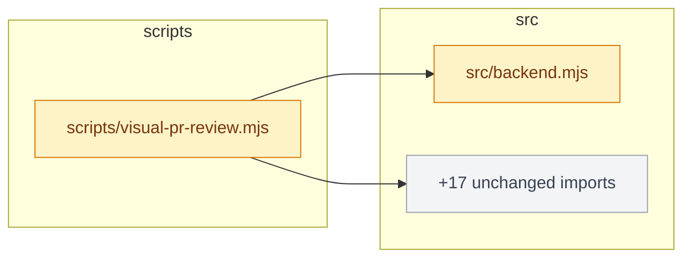
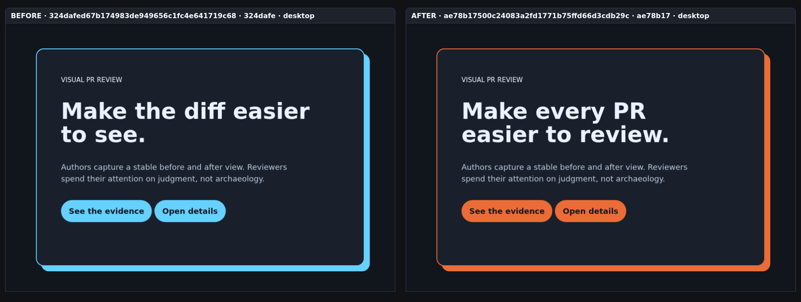
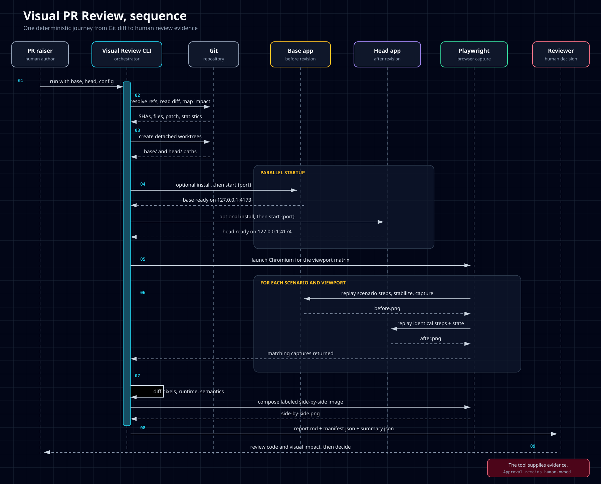

<p align="center">
  
</p>

<h1 align="center">Visualize PR</h1>

<p align="center"><code>/visualize-pr</code> turns a pull request into reviewer-ready evidence and writes it into the PR itself.</p>

<p align="center"><sub>Type <code>/visualize-pr</code> in Claude Code (with the plugin installed) or run the CLI directly.</sub></p>

Boot **two exact Git revisions side by side on your own machine**, replay the same reviewer
states on both, and write one evidence directory a human can act on. Web changes get real browser
screenshots and runtime evidence. Backend changes get a change map and a sequence diagram. Your
own notes go first. Nothing is published until you say so.

## Table of contents

- [Why this exists](#why-this-exists)
- [In 60 seconds](#in-60-seconds)
- [Review, then approve](#review-then-approve)
- [What lands in the PR](#what-lands-in-the-pr)
- [ASCII fallback](#ascii-fallback)
- [Providers](#providers)
- [Two review modes](#two-review-modes)
- [Capabilities](#capabilities)
- [How the agent runs it](#how-the-agent-runs-it)
- [Live examples](#live-examples)
- [Setup and quick start](#setup-and-quick-start)
- [Usage examples](#usage-examples)
- [CLI reference](#cli-reference)
- [CI](#ci)
- [Requirements](#requirements)
- [Safety boundary](#safety-boundary)
- [Development](#development)
- [License](#license)

## Why this exists

A line diff can prove which code changed. It cannot prove what the checkout looked like, whether
the mobile state broke, whether the new page emitted runtime errors, or which backend modules
absorbed the change. This skill captures those reviewer-facing facts while the author still has
the context to explain them, and puts the author's explanation first.

Use it when:

- a web PR needs reproducible before-and-after evidence,
- a backend PR needs a concise change map and a sequence diagram rather than a wall of files,
- a reviewer should receive the same evidence without rebuilding both revisions,
- a team wants a local draft, and a one-click approval, before anything leaves the machine.

[docs/competitive-landscape.md](docs/competitive-landscape.md) covers what 16 checked projects do
and do not do; [docs/product-thesis.md](docs/product-thesis.md) covers scope, threat model, and
non-goals.

## In 60 seconds

From a clone of the repository the PR belongs to. Step one drafts and posts nothing:

```bash
node <skill>/scripts/visualize-pr.mjs --pr https://github.com/<owner>/<repo>/pull/<n> --backend --output out
```

That resolves the PR's exact base and head commits, analyzes the diff, and writes `out/report.md`
and `out/pr-comment.md` with a change map. Read the draft. Step two publishes it as written, in
under a second:

```bash
node <skill>/scripts/visualize-pr.mjs --publish out --update-description
```

The review block goes at the top of the PR description, between invisible markers; whatever the
description already said is folded under it in a collapsible "Original description" on GitHub and
GitLab, and demoted under a plain heading on Bitbucket Cloud, which strips HTML. Re-run and only
the block is replaced, in place; a block an older version left at the bottom is lifted to the top first. Swap `--update-description` for `--post-comment`, or pass both. A Bitbucket Cloud or
GitLab URL works the same way; see [Providers](#providers) for the token each one reads.

For a web change, generate a config first, then run without `--backend`:

```bash
node <skill>/scripts/visualize-pr.mjs --init
```

`--init` detects the framework (Next, Vite, Astro, Nuxt, Angular, SvelteKit, Remix, Django, Rails,
Laravel, Go, static HTML, and more), picks the install command from your lockfile, and seeds a home
scenario on desktop and mobile. Edit the start command if needed, add scenarios for the pages the
PR touches, and run.

## Review, then approve

Nothing leaves your machine until you say so, and saying so is one click in every harness.

1. The review run writes the draft and stops. It prints the publish command.
2. The agent shows you the draft inline and asks: **post as a comment**, **update the
   description**, **both**, or **not now**.
   - In Claude Code those four choices render as buttons.
   - In Codex and other harnesses the agent proposes the single publish command, and the
     harness's own command-approval prompt is the button.
3. Approval runs `--publish <dir>` with the flag you picked. No re-diff, no fetch, no browser.
   What you read is what lands. A GitHub web review uploads its screenshots at that moment and
   appends them below the text you already read.

"Not now" ends with the draft path and the publish command written out, so you can run it later
yourself. Passing `--post-comment` or `--update-description` on the review run itself still works
and skips the checkpoint; the agent only does that when you asked for it up front.

## What lands in the PR

The block reads top down in the order a reviewer needs it: a headline and a few bullets in the
agent's words, a short pseudocode block, the sequence diagram, then one line of numbers. It is
written like a message to a colleague, not a report: bullets under 30 words, pseudocode under 8
lines, a diagram with at most 4 participants and 6 messages, and the CLI warns when any of those
is exceeded. Here is a real one, a Bitbucket PR that changed how a listing-count endpoint parses
its filters:

~~~markdown
## Visual review

**AI-4176 accept value arrays and match every spelling** `development` (`6934b9a`) -> `AI-4176` (`434fab5`)

Filters accept arrays and match every spelling of a value.

- `property_type`, `listing_type`, `status`: array, repeated param, or `A,B`. Objects still 400, so `uid[$ne]` never reaches `$match`.
- Each value expands to all stored spellings. District 1024, `for rent` + `room rental`: 206 of 363 before, 363 now.
- Unknown values pass through and are listed in `meta.unrecognized`: a typo is visible, not a silent 0.
- Also fixed: `limit=0` returned 500, paging repeated rows, `uid` past 2^53 rounded silently, empty `?status=` dropped the filter.

Heads up: `for sale` now also matches `For Sale` and `SALE`, about 900 more listings nationally. Intended.

```
for v in values:
    expanded += VALUE_GROUPS[field][lower(v)] or [v]   # unknown: pass through, report
match[field] = { $in: expanded }
```

### Sequence

```text
       Caller        listingCount()    expandValues()      MongoDB
         |                 |                 |                 |
         |  GET listing_count                |                 |
         |---------------->|                 |                 |
         |                 |  expand values  |                 |
         |                 |---------------->|                 |
         |                 |  all spellings  |                 |
         |                 <- - - - - - - - -|                 |
         |                 |  $in expanded   |                 |
         |                 |---------------------------------->|
         |  200 data, meta |                 |                 |
         <-----------------|                 |                 |
```

1 file changed (+110 -20): `src/controllers/agentStats.controller.js`

> Generated by `visualize-pr`. Evidence for a reviewer, not an approval.
~~~

The headline, bullets, Heads up line, and pseudocode came from the agent through `--notes`; the
sequence diagram came through `--diagram`. The change map is omitted here because the diff touched
one file with one import, which the file line already says; it appears for larger changes. Fenced, not indented: after a bullet
list an indented block is plain text in CommonMark, and the CLI warns when it sees one. SKILL.md asks for exactly that. The
module table appears only with two or more modules, the most-changed ranking only with more than
three files, so a small change is not padded. The block sits between CommonMark link reference
definitions, `[//]: # (visualize-pr:start)` and its end, which render as nothing on GitHub,
GitLab, and Bitbucket Cloud; a re-run replaces it in place with no visible markers. This example
is on Bitbucket, so the diagrams arrived as text; on GitHub and GitLab they are Mermaid.

The Mermaid form of a change map, from [PR #2](https://github.com/aryswisnu/skills/pull/2),
trimmed:



Green means added, amber modified, red deleted, grey untouched. When a file imports more than five
unchanged modules they fold into one node so the diagram stays readable. The import graph covers
JavaScript and TypeScript, Python, Go, Ruby, PHP, Java and Kotlin, Rust, and C#.

The `--diagram` file is linted for the two Mermaid mistakes that render wrong instead of failing:
a `%%` comment that is not at the start of a line, and angle brackets inside a label. Both are
warnings with line numbers; the run continues.

A web review adds real browser evidence, uploaded to a `visual-review-assets` branch and embedded:

[](docs/pr-comment-examples.md)

Every web cell gets a verdict: `unchanged`, `changed-within-threshold`, `review-required`, or
`capture-failed`. None of them approves anything. Full rendered examples:
[docs/pr-comment-examples.md](docs/pr-comment-examples.md).

## ASCII fallback

Mermaid is only useful where it is rendered. GitHub and GitLab render it; Bitbucket Cloud renders
CommonMark only, so a Mermaid fence there shows as raw source. The CLI therefore picks the diagram
form per provider, and `--ascii` forces text anywhere, including the local `report.md`, for a
terminal, an email, or any renderer without Mermaid. Both `change-map.mmd` and `change-map.txt`
are written on every backend run regardless.

The change map as text, real output from this repository over six commits, trimmed:

```text
Change map  713e339 -> e31d673  (19 changed files)

  scripts/
    [M] visualize-pr.mjs             -> ascii.mjs, providers.mjs, report.mjs, +21 unchanged imports
  src/
    [A] ascii.mjs
    [M] backend.mjs
    [A] provider-bitbucket.mjs
    [ ] provider-github.mjs          (imported by 1)
    [A] provider-gitlab.mjs
    [A] providers.mjs                -> provider-bitbucket.mjs, provider-github.mjs, provider-gitlab.mjs
    [M] report.mjs                   -> backend.mjs
  test/
    [A] ascii.test.mjs               -> ascii.mjs
    [A] providers.test.mjs           -> pr-url.mjs, providers.mjs

  [A] added  [M] modified  [D] deleted  [R] renamed  [ ] unchanged
```

Files group by directory. Each line carries a status marker, the file, and the in-repo files it
imports; an unchanged file that a changed file imports shows how many import it instead. More than
five unchanged imports from one file fold into a single `+N unchanged imports` target, listed
last.

The `--diagram` sequence diagram gets the same treatment. A Mermaid `sequenceDiagram` is redrawn
as text: participants and aliases, solid and dashed arrows, self-messages, notes, and
loop/alt/opt/par blocks. Real output:

```text
       Dev        visualize-pr      Bitbucket
        |               |               |
        |  --pr <url> --backend         |
        |--------------->               |
        |               |  GET pullrequests/N
        |               |--------------->
        |               |  200          |
        |               <- - - - - - - -|
        |               [ draft written ]
        |  --publish out|               |
        |--------------->               |
        |               |  PUT description
        |               |--------------->
```

Any Mermaid the renderer cannot parse is shown as fenced source rather than dropped, so nothing
the agent wrote is lost. Which form was used is recorded in `pr.json`, so `--publish` keeps it.

## Providers

The provider is read from the URL's path shape, not its host, so self-hosted instances work with
no configuration.

| Provider | URL shape | Token | Diagrams | Screenshots |
| --- | --- | --- | --- | --- |
| GitHub | `/owner/repo/pull/N` | `GITHUB_TOKEN` or `GH_TOKEN` | Mermaid | uploaded and embedded |
| Bitbucket Cloud | `/workspace/repo/pull-requests/N` | `BITBUCKET_TOKEN`, or `BITBUCKET_USERNAME` with `BITBUCKET_APP_PASSWORD` | ASCII (Bitbucket does not render Mermaid) | stay local; verdicts and diagrams post |
| GitLab | `/group/.../repo/-/merge_requests/N` | `GITLAB_TOKEN` (or `CI_JOB_TOKEN`) | Mermaid | stay local; verdicts and diagrams post |

Backend reviews upload nothing anywhere. Nested GitLab groups are handled. Bitbucket returns
abbreviated commit hashes, so the CLI fetches the PR's branches with the clone's own credentials
and resolves the hashes locally. Bitbucket Server (Data Center) is detected and refused with a
message; Azure DevOps is not implemented.

## Two review modes

| | Backend (`--backend`) | Web (default) |
| --- | --- | --- |
| Needs | Git, Node 20+ | plus `visual-review.json`, Chromium |
| Boots the app | No | Yes, both revisions on separate local ports |
| Produces | change summary, change map (Mermaid and ASCII), `architecture.svg` | before/after/side-by-side/diff PNGs per scenario and viewport, console and request errors, ARIA snapshot |
| Diagrams | Mermaid, or ASCII where the forge does not render Mermaid or with `--ascii` | sequence diagram from `--diagram`, same rule |
| Uploads | Nothing, on any provider | GitHub only: side-by-side PNGs to `visual-review-assets`, at publish time |
| Config | None | `--init` writes a starter |

Both modes write `report.md`, `summary.json`, `manifest.json`, `changes.patch`,
`changes-stat.txt`, and with `--pr` the `pr-comment.md` draft plus `pr.json` that `--publish`
reads. Web manifests carry SHA-256 hashes of every artifact, the browser build, and redacted
commands, so a reviewer can check the directory matches the commits.



## Capabilities

| | |
| --- | --- |
| **Two live revisions** | Both revisions are checked out into detached worktrees and started on separate local ports. Nothing is stored as a baseline. |
| **Pull request URL** | `--pr <url>` takes a GitHub PR, Bitbucket Cloud PR, or GitLab MR (self-hosted too, detected from the path shape), resolves base and head SHAs, and writes a draft that `--publish` posts. |
| **Notes first** | `--notes <file.md>` places the agent's bullets and pseudocode directly under the title, above everything generated. |
| **Backend / non-web** | `--backend` analyzes the diff and emits a one-line change summary plus a change map of changed files and their in-repo imports, no browser or config required. Written as Mermaid (`change-map.mmd`) and ASCII (`change-map.txt`). Nothing is uploaded. |
| **Sequence diagram** | `--diagram <file.mmd>` inserts an agent-authored Mermaid `sequenceDiagram` of the changed behavior, redrawn as text where Mermaid is not rendered. |
| **Scenario replay** | A validated action list (`goto`, `click`, `fill`, `press`, `select`, `waitForSelector`, `assertVisible`, `assertText`) is replayed identically on base and head. |
| **Capture matrix** | Scenario x viewport, with deterministic artifact names. |
| **Deterministic capture** | Reduced motion, animations disabled, caret hidden, plus configurable `hideSelectors` and `maskSelectors`. |
| **Runtime evidence** | Page errors, console errors, failed requests, document status and assertion failures, recorded separately for each revision. |
| **Semantic evidence** | Normalized title, selected DOM text, and an optional Playwright ARIA snapshot. |
| **Code-aware selection** | No rules means all scenarios. With rules, matches run; no match uses configured smoke scenarios, or all when the smoke list is empty. |
| **Thresholded verdicts** | `unchanged`, `changed-within-threshold`, `review-required`, `capture-failed`. None of them approves a pull request. |
| **Web provenance** | Public-config digest, SHA-256 for every listed artifact except the manifest itself, browser build, redacted commands, env key names only. |

## How the agent runs it

Type `/visualize-pr <pr-url>` in Claude Code. The skill is user-invoked: the agent never fires it on
its own, because it runs the install and start commands of both revisions. The workflow it follows:

1. Check for dependencies; run `--setup` if `node_modules` is missing.
2. Resolve base and head to exact SHAs, read the diff, decide backend or web.
3. If web and no `visual-review.json`, run `--init`, fix the start command against the repo's own
   scripts, add scenarios for the paths the diff touches.
4. Run the CLI with no publish flag. Read `changes.patch`. Write the notes (bullets and pseudocode)
   and a Mermaid `sequenceDiagram` of the changed call flow, the diagram skipped and said so when
   the diff has no behavior change.
5. Re-run with `--notes` and `--diagram` and a fresh output directory. Inspect `report.md` and the
   images.
6. Show the draft and ask, as in [Review, then approve](#review-then-approve). On approval run
   `--publish`. This is the only point at which publication is authorized.

The full contract, including exit codes, evidence accounting, and cleanup checks, is in
[SKILL.md](SKILL.md).

## Live examples

- [PR #1](https://github.com/aryswisnu/skills/pull/1): web review, [posted comment](https://github.com/aryswisnu/skills/pull/1#issuecomment-5657518950) with three embedded side-by-side images.
- [PR #2](https://github.com/aryswisnu/skills/pull/2): backend review. The description carries the Mermaid change map written by `--update-description`; the [earlier comment](https://github.com/aryswisnu/skills/pull/2#issuecomment-5657923277) shows the v0.6 PNG form for comparison.

Both are kept open on purpose.

## Setup and quick start

Plugin installers copy files but do not run npm, so the skill installs its own dependencies on
request:

```bash
node <skill>/scripts/visualize-pr.mjs --setup
```

That pulls the npm dependencies and Chromium into the skill's own folder. Add `--backend` to
install the dependencies only and skip the 100MB browser download; backend reviews need nothing
else. The agent runs this for you before the first review, and any `Missing dependency` error
names the same flag. Running on Node 18 exits at once with the minimum version and how to switch.
To reuse a browser you already have:

```bash
export VISUAL_REVIEW_BROWSER_PATH=/path/to/chrome-headless-shell
```

The installed folder is `~/.claude/plugins/marketplaces/aryswisnu/skills/engineering/visualize-pr`
for the plugin route, or wherever skills.sh put it.

For a web review, generate a starter config in the application repository:

```bash
node <skill>/scripts/visualize-pr.mjs --init
```

It detects the framework, writes `visual-review.json`, and prints notes about what to check.
Confirm `startCommand` against the repo's own scripts and add the scenarios that matter. A finished
config looks like this:

```json
{
  "startCommand": "npm run dev -- --host 127.0.0.1 --port {port}",
  "viewports": [
    { "name": "desktop", "width": 1440, "height": 900 },
    { "name": "mobile", "width": 390, "height": 844 }
  ],
  "capture": { "hideSelectors": [".relative-timestamp"] },
  "scenarios": [
    { "id": "home", "path": "/", "viewports": ["desktop", "mobile"] },
    {
      "id": "checkout-error",
      "name": "Checkout showing a declined card",
      "path": "/checkout",
      "steps": [
        { "action": "fill", "selector": "#card-number", "value": "4000000000000002" },
        { "action": "click", "selector": "#pay" },
        { "action": "waitForSelector", "selector": "[role='alert']" },
        { "action": "assertText", "selector": "[role='alert']", "contains": "declined" }
      ]
    }
  ],
  "impact": {
    "rules": [{ "glob": "src/checkout/**", "scenarios": ["checkout-error"] }],
    "smokeScenarios": ["home"]
  }
}
```

Then run:

```bash
node <skill>/scripts/visualize-pr.mjs --base origin/main --head HEAD --config visual-review.json --output visual-review-output
```

Open `visual-review-output/report.md`. Full annotated configurations:
[`examples/configs/minimal.json`](examples/configs/minimal.json) and
[`examples/configs/full.json`](examples/configs/full.json). Reference for every key:
[docs/configuration.md](docs/configuration.md).

## Usage examples

See [docs/usage-examples.md](docs/usage-examples.md) for:

- Installation and local branch comparison
- GitHub, Bitbucket Cloud, and GitLab pull request URLs, with the token each one needs
- Review the draft, then publish it; lead with notes; add a sequence diagram; force ASCII
- Backend / non-web changes
- Static HTML, Node, Python, and Go previews
- Desktop and mobile viewports
- Interactive scenarios, masks, impact rules, and focused runs
- Manual GitHub Actions usage
- Clearly marked, not-yet-implemented designs for Azure DevOps, Bitbucket Server, backend API,
  CLI, schema, image-pair, mixed-PR, and direct-CDP workflows

## CLI reference

```text
Review
  --pr <url>            GitHub, Bitbucket Cloud, or GitLab pull/merge request URL
  --base <ref>          Base git revision, required unless --pr is used
  --head <ref>          Head git revision, default: HEAD
  --backend             Diff summary + change map, no browser or config
  --notes <path>        Agent-written markdown (bullets, pseudocode) placed at the top of the PR text; linted, warnings only
  --diagram <path>      Mermaid file (for example a sequenceDiagram) to include; linted, warnings only
  --ascii               Draw the change map and sequence diagram as ASCII (automatic on Bitbucket Cloud)
  --config <path>       Config path, default: visual-review.json
  --output <path>       Artifact directory, default: visual-review-output (must not exist)
  --scenario <id>       Capture only this scenario, repeatable, overrides impact rules
  --all                 Capture every configured scenario, ignoring impact rules
  --keep-worktrees      Preserve temporary worktrees for debugging

Publish
  --publish <dir>       Post the reviewed draft in <dir>/pr-comment.md; nothing is recomputed
  --post-comment        Post the review as a PR comment (with --pr or --publish)
  --update-description  Insert or refresh the review block in the PR description (with --pr or --publish)

Setup
  --setup               Install this skill's npm dependencies and Chromium, then exit (--backend skips Chromium)
  --init                Write a starter visual-review.json for this repo, then exit
```

Exit codes: `0` comparable evidence for every selected cell, `1` at least one scenario failed to
capture (partial report), `2` usage, configuration, or infrastructure failure (`failure.json`
written when possible), `130` SIGINT, `143` SIGTERM.

## CI

[`examples/github-actions/visual-pr-review.yml`](examples/github-actions/visual-pr-review.yml)
is a manual, opt-in `workflow_dispatch` example. It does not run automatically, and it only
uploads the evidence directory when the `upload-evidence` input is explicitly enabled. The file
carries a prominent disclosure that enabling upload authorizes newly generated evidence to leave
the runner without a post-capture inspection checkpoint. Use synthetic data and keep upload off
when the generated files must be inspected first. It never posts comments, reviews, or statuses.

## Requirements

Node.js 20 or newer (checked at startup), Git, Linux or macOS. Windows is not claimed:
process-group cleanup and shell semantics are only tested on POSIX. Web reviews need Playwright
Chromium, which `--setup` installs, or a compatible executable via `VISUAL_REVIEW_BROWSER_PATH`.

## Safety boundary

- Web mode runs the install and start commands of **both** revisions. That is arbitrary code
  execution by design. Use trusted revisions or a sandbox.
- Browser navigation is pinned to the local preview origin for main-frame documents. Application
  processes and outbound requests are not isolated.
- Environment values and command credentials are redacted from structured artifacts. Screenshots
  are masked only at configured selectors; look at the images before sharing.
- Nothing leaves your machine without `--post-comment` or `--update-description`, and the normal
  path puts those behind `--publish`, after you have read the draft. The description update
  touches only the block between the invisible markers.
- Non-GitHub providers get no injected git credential; the clone's own credentials fetch the
  branches.

## Development

From this skill directory:

```bash
npm install
npm test
npm audit --audit-level=high
npm pack --dry-run
```

Users install dependencies with `node scripts/visualize-pr.mjs --setup`; the commands above are the
maintainer equivalents. CI runs the suite on Ubuntu and macOS for every push and PR.

For an end-to-end browser check, create a scratch Git repository with two commits containing the
bundled `examples/demo/` application, then invoke this skill's CLI from the scratch repository.
[docs/verification.md](docs/verification.md) records the exact procedure and observed results.

## License

MIT
