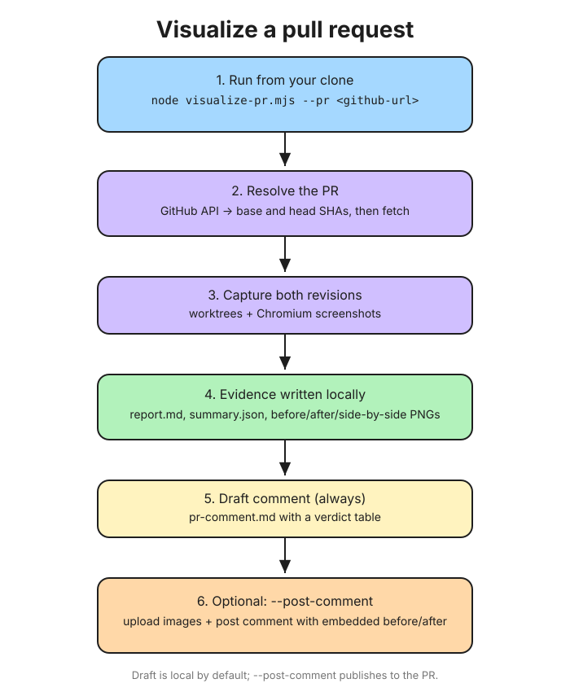
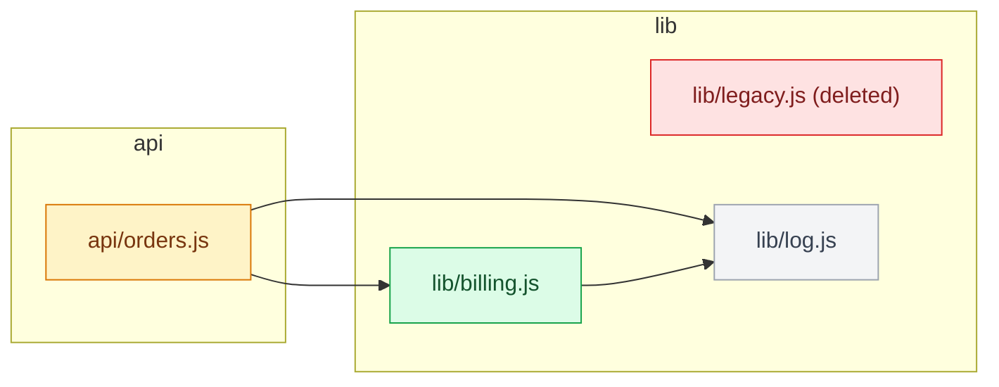

<p align="center">
  
</p>

<h1 align="center">Visual PR Review</h1>

<p align="center"><code>/visualize-pr</code> turns code changes into reviewer-ready visual, semantic and runtime evidence.</p>

<p align="center"><sub>Type <code>/visualize-pr</code> in Claude Code (with the plugin installed) or run the CLI directly.</sub></p>

Boot **two exact Git revisions side by side on your own machine**, replay equivalent reviewer states,
and write one evidence directory a human can act on. Web changes get real browser screenshots and
runtime evidence. Backend changes get a diff summary and editorial change map. No committed
baselines, hosted review account, or silent publication.

## Table of contents

- [Why this exists](#why-this-exists)
- [What the reviewer gets](#what-the-reviewer-gets)
- [Capabilities](#capabilities)
- [Sequence](#sequence)
- [How to use](#how-to-use)
- [What the PR comment looks like](#what-the-pr-comment-looks-like)
- [Live example](#live-example)
- [Quick start](#quick-start)
- [Usage examples](#usage-examples)
- [CLI](#cli)
- [CI](#ci)
- [Platforms](#platforms)
- [Safety boundary](#safety-boundary)
- [Development](#development)
- [License](#license)

## Why this exists

A line diff can prove which code changed. It cannot prove what the checkout looked like, whether the
mobile state broke, whether the new page emitted runtime errors, or which backend modules absorbed
the change. Visual PR Review captures those reviewer-facing facts while the author still has the
context to explain them.

Use it when:

- a web PR needs reproducible before-and-after evidence,
- a backend PR needs a concise change map rather than a wall of files,
- a reviewer should receive the same evidence without rebuilding both revisions,
- a team wants a local draft before deciding whether anything leaves the machine.

See [what the generated PR comment looks like](docs/pr-comment-examples.md).

See [docs/competitive-landscape.md](docs/competitive-landscape.md) for what 16 checked projects do
and do not do, and [docs/product-thesis.md](docs/product-thesis.md) for the scope, threat model,
and non-goals.

## What the reviewer gets

Both modes write `report.md`, `summary.json`, `manifest.json`, `changes.patch`, and
`changes-stat.txt`. With `--pr`, both also write
[`pr-comment.md`](docs/pr-comment-examples.md).

Web reviews additionally produce collision-resistant per-cell
`before|after|side-by-side|diff.png` paths. Their manifest records full commit SHAs, the public-config
digest, browser details, redacted commands, environment key names, and SHA-256 hashes for every
listed artifact except the manifest itself. Browser infrastructure failures after output creation
write `failure.json` with the phase, redacted error, and cleanup outcome.

Backend reviews additionally produce `change-map.mmd` (a Mermaid import graph of the changed
files, also embedded in `report.md` and `pr-comment.md`) and `architecture.svg` (a churn chart).
Their smaller manifest records the backend summary, full commit SHAs, and
generation time, but does not contain the web manifest's config, browser, command, or artifact-hash
provenance.

## Capabilities

| | |
| --- | --- |
| **Two live revisions** | Both revisions are checked out into detached worktrees and started on separate local ports. Nothing is stored as a baseline. |
| **Pull request URL** | `--pr <github-url>` resolves base and head SHAs, runs the same capture, and (with `--post-comment`) uploads the images and posts the review as a PR comment. |
| **Backend / non-web** | `--backend` analyzes the diff and emits a change summary plus a Mermaid change map (`change-map.mmd`, a flowchart of changed files and their in-repo imports, colored by status), no browser or config required. GitHub renders it natively, so nothing is uploaded. |
| **Sequence diagram** | `--diagram <file.mmd>` inserts an agent-authored Mermaid `sequenceDiagram` of the changed behavior as a `### Sequence` section in the report and PR text. |
| **Scenario replay** | A validated action list (`goto`, `click`, `fill`, `press`, `select`, `waitForSelector`, `assertVisible`, `assertText`) is replayed identically on base and head. |
| **Capture matrix** | Scenario x viewport, with deterministic artifact names. |
| **Deterministic capture** | Reduced motion, animations disabled, caret hidden, plus configurable `hideSelectors` and `maskSelectors`. |
| **Runtime evidence** | Page errors, console errors, failed requests, document status and assertion failures, recorded separately for each revision. |
| **Semantic evidence** | Normalized title, selected DOM text, and an optional Playwright ARIA snapshot. |
| **Code-aware selection** | No rules means all scenarios. With rules, matches run; no match uses configured smoke scenarios, or all when the smoke list is empty. |
| **Thresholded verdicts** | `unchanged`, `changed-within-threshold`, `review-required`, `capture-failed`. None of them approves a pull request. |
| **Web provenance** | Public-config digest, SHA-256 for every listed artifact except the manifest itself, browser build, redacted commands, env key names only. |

## Sequence


## How to use



Editable source: [docs/visualize-pr-usage.excalidraw](docs/visualize-pr-usage.excalidraw) (open at excalidraw.com).

## What the PR comment looks like

`--pr` writes a local `pr-comment.md` containing the verdict table and attention list. For web
reviews, `--post-comment` first uploads the side-by-side images, rebuilds `pr-comment.md` with an
Evidence section, and posts that image-bearing version. Backend reviews carry their change map as a
Mermaid block, so `--post-comment` uploads nothing. `--update-description`
writes the same markdown into the PR description instead, inside `<!-- visualize-pr:start -->` and
`<!-- visualize-pr:end -->` markers, so a repeat run replaces the block rather than appending a second
copy. The two flags can be combined.


Backend reviews embed a Mermaid change map (rendered by GitHub) and, with `--diagram`, a sequence
diagram:



The earlier PNG-based change map is kept for reference:


See [the complete web and backend comment examples](docs/pr-comment-examples.md), including
the verdict table, attention list, evidence placement, backend change summary, and exact publication
boundary.

## Live example

This repository keeps two real, open demonstrations:

Web:

- [PR #1: docs/live-visual-review-demo](https://github.com/aryswisnu/skills/pull/1) is a genuine web pull request produced by this CLI,
- [its generated review comment](https://github.com/aryswisnu/skills/pull/1#issuecomment-5657518950) shows the posted, image-bearing form with three embedded side-by-side artifacts.

Backend:

- [PR #2: docs/live-backend-review-demo](https://github.com/aryswisnu/skills/pull/2) is a genuine non-web pull request produced by this CLI,
- [its generated review comment](https://github.com/aryswisnu/skills/pull/2#issuecomment-5657923277) shows the posted form with an embedded change-map image.

Each comment was posted with `--post-comment`; the PR descriptions were not modified.

## Quick start

```bash
npm install
npx playwright install chromium
# Or reuse a compatible browser:
# export VISUAL_REVIEW_BROWSER_PATH=/path/to/chrome-headless-shell
```

In the application repository, generate a starter config:

```bash
node /path/to/visualize-pr/scripts/visualize-pr.mjs --init
```

It detects the framework, writes `visual-review.json`, and prints notes about what to check.
Read those notes, confirm `startCommand` against the repo's own scripts, and add the scenarios that
matter. This is what a finished config looks like, so edit to taste:

```json
{
  "startCommand": "npm run dev -- --host 127.0.0.1 --port {port}",
  "viewports": [
    { "name": "desktop", "width": 1440, "height": 900 },
    { "name": "mobile", "width": 390, "height": 844 }
  ],
  "capture": { "hideSelectors": [".relative-timestamp"] },
  "scenarios": [
    { "id": "home", "path": "/", "viewports": ["desktop", "mobile"] },
    {
      "id": "checkout-error",
      "name": "Checkout showing a declined card",
      "path": "/checkout",
      "steps": [
        { "action": "fill", "selector": "#card-number", "value": "4000000000000002" },
        { "action": "click", "selector": "#pay" },
        { "action": "waitForSelector", "selector": "[role='alert']" },
        { "action": "assertText", "selector": "[role='alert']", "contains": "declined" }
      ]
    }
  ],
  "impact": {
    "rules": [{ "glob": "src/checkout/**", "scenarios": ["checkout-error"] }],
    "smokeScenarios": ["home"]
  }
}
```

Then run:

```bash
node /path/to/visualize-pr/scripts/visualize-pr.mjs \
  --base origin/main \
  --head HEAD \
  --config visual-review.json \
  --output visual-review-output
```

Open `visual-review-output/report.md`.

Full annotated configurations: [`examples/configs/minimal.json`](examples/configs/minimal.json) and
[`examples/configs/full.json`](examples/configs/full.json). Reference for every current key:
[docs/configuration.md](docs/configuration.md).

## Usage examples

See [docs/usage-examples.md](docs/usage-examples.md) for:

- Installation and local branch comparison
- A GitHub pull request URL (`--pr`), with a local draft and opt-in posting with embedded side-by-side images
- Backend / non-web changes (`--backend`), with a change summary and architecture diagram
- Static HTML, Node, Python, and Go previews
- Desktop and mobile viewports
- Interactive scenarios, masks, impact rules, and focused runs
- Manual GitHub Actions usage
- Clearly marked, not-yet-implemented designs for Bitbucket, GitLab, Azure DevOps,
  GitHub description-update, backend API, CLI, schema, image-pair, mixed-PR, and direct-CDP workflows

Only examples under **Available now, v0.9.0** describe executable behavior in this release.

## CLI

```text
--base <ref>       Base git revision, required unless --pr is used
--head <ref>       Head git revision, default: HEAD
--pr <url>         GitHub pull request URL; resolves base and head SHAs
--backend          Analyze the diff and emit a change summary + architecture diagram (no browser)
--post-comment     Upload evidence, embed images, and post as a PR comment (requires --pr)
--diagram <path>   Mermaid file (for example a sequenceDiagram) to include in the report and PR text
--update-description  Insert or refresh the review section in the PR description (requires --pr)
--config <path>    Config path, default: visual-review.json
--init             Write a starter visual-review.json for this repo, then exit
--output <path>    Artifact directory, default: visual-review-output
--scenario <id>    Capture only this scenario, repeatable, overrides impact rules
--all              Capture every configured scenario, ignoring impact rules
--keep-worktrees   Preserve temporary worktrees for debugging
```

Exit codes: `0` every selected scenario produced comparable evidence, `1` at least one scenario
could not be captured and the report is partial, `2` usage, configuration, or infrastructure
failure, `130` interrupted by SIGINT, and `143` interrupted by SIGTERM. Infrastructure failures
and interruptions write `failure.json` when the output directory has been created.

## CI

[`examples/github-actions/visual-pr-review.yml`](examples/github-actions/visual-pr-review.yml)
is a manual, opt-in `workflow_dispatch` example. It does not run automatically, and it only
uploads the evidence directory when the `upload-evidence` input is explicitly enabled. The file
carries a prominent disclosure that enabling upload authorizes newly generated evidence to leave
the runner without a post-capture inspection checkpoint. Use synthetic data and keep upload off
when the generated files must be inspected first. It never posts comments, reviews, or statuses.

## Platforms

Linux and macOS. Windows is not claimed: process-group cleanup and shell semantics are only
tested on POSIX.

## Safety boundary

The tool runs the install and start commands of **both** git revisions, which is arbitrary code
execution by design. Use trusted revisions or a sandbox. Navigation is pinned to the local
preview origin for main-frame documents, but application processes and every outbound browser
request are not isolated. Environment values are redacted from structured artifacts, and recorded
commands are redacted. Screenshots are evidence, not approval, and are masked only at configured
selectors.

## Development

From this skill directory:

```bash
npm install
npm test
npm audit --audit-level=high
npm pack --dry-run
```

For an end-to-end browser check, create a scratch Git repository with two commits containing the
bundled `examples/demo/` application, then invoke this skill's CLI from the scratch repository.
[docs/verification.md](docs/verification.md) records the exact procedure and observed results.

## License

MIT
